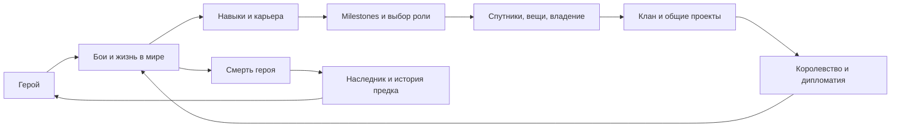

# BLT против ShedLink: аудит глубины механик

28.09.2026. **База ShedLink: `claude/poststream-2026-09-22`, `0cdf6338`.** Результат сохранён в рабочей папке 0.0.6; её runtime не использован вместо указанной ветки. Это исследование исходников и выбранной истории, без реализации, сборки сторонних модов, запуска игры и deployment.

## Краткая GAP-таблица

Категории: **A** — аналог уже есть; **B** — есть, но конкретное расширение BLT глубже; **C** — отдельная возможность отсутствует в рассмотренных активных путях; **D** — существующий вариант ShedLink предпочтительнее по указанному критерию; **E** — прямой перенос противоречит выбранной концепции или архитектуре. Категория относится к строке, а не ко всей системе. `HIST` — подтверждено историческим кодом; `GUIDE` — только описанием конфигурации; `HYP` — наша гипотеза, не найденная готовая BLT-механика.

Лицензии в таблице: **L** — BLT LGPL-2.1 reference, reuse условный; **M** — standalone MBGA заявляет MIT, но full notice/provenance требуют проверки; **F** — полный Mesmer fork со смешанным происхождением, не весь MIT; **I** — IDEA ONLY. Подробности и точные пины — в разделе источников. Ссылки P/C/W ведут к подробным разборам ниже с файлами, методами, API и сохранением.

| BLT mechanic | ShedLink equivalent | Gap | Adaptation value | Difficulty | Source/API | License |
|---|---|---|---|---|---|---|
| AdoptAHero, постоянный герой | Реальный Hero, identity/save, существование в кампании | A; не добавлять снова | Уже есть | — | [W](#world-details), HeroCreator/SyncData | L/F |
| Skills/focus/attributes | Native HeroDeveloper, покупка/прирост, snapshots | A | Уже есть | — | [P](#progression-details), HeroDeveloper | L/F |
| Class/build progression | Legacy классы + новый game-owned weapon build | B только для более богатых milestones | Высокая | Средняя–высокая | [P](#progression-details), ClassLevelRequirement | L/F |
| Achievement badges | 13 действующих Bannerlord achievements | A | Не создавать второй engine | — | [P](#progression-details), AchievementDef | L/F |
| Hero/class/weapon career stats | Агрегаты зрителя текущей кампании | B: scope героя, классовые/оружейные counters | Очень высокая | Средняя | [P](#progression-details), AchievementStatsData | L/F |
| Составные conditions и награды достижений | Фиксированные thresholds, notification | B: AND/сравнения, игровой unlock/награда | Высокая | Средняя | [P](#progression-details), IAchievementRequirement | L/F |
| Составные powers / per-effect unlock | Выбранная weapon power, skill ranks, specialization | B: несколько компонентов с разными условиями | Высокая | Высокая | [C](#combat-details), PowerGroupItemBase | L/F |
| Ally aura / реакция на low HP | Уже есть self-heal, poison, lifesteal, AoE и другие эффекты | B: кооперативная/реактивная роль | Средняя–высокая | Средняя–высокая | [C](#combat-details), Agent/mission ticks | M/F |
| Prestige reset | Iteration bonus + настоящая династия | C для reset-prestige; legacy уже частично есть | Условная | Высокая | [P](#progression-details), DoPrestige | F/I |
| Виртуальные gear T7/T8, бесконечные множители | Нативные items/modifiers и skill ranks | E для буквального переноса | Низкая | Баланс сложнее кода | [P](#progression-details), Agent patches | F/M |
| Обычная/элитная retinue | Recruit/upgrade/train/spawn/атрибуция/сейв | A | Уже есть | — | [C](#combat-details), UpgradeTargets | L/F |
| Второй отдельный roster | Один список basic/elite slots | B: группы/замена состава, не просто больше агентов | Средняя | Средняя | [C](#combat-details), Retinue2 | L/F |
| Guard + follow selected ally | Приказы отдельно герою | B: свита охраняет героя; герой сопровождает союзника | Высокая | Средняя, native риск | [C](#combat-details), Agent scripted AI | M |
| Hold/charge/siege orders | Hold/charge/skirmish/raid/walls/gate | A/D по набору наших приказов | Не переносить систему целиком | — | [C](#combat-details), HeroDetachmentBehavior | L/F |
| Summon escalation | Cooldown, side lock, once-per-battle retinue | B: рост задержки повторных призывов | Условная | Небольшая–средняя | [C](#combat-details), BLTSummonBehavior | L/F |
| Kill streaks / battle rewards | Вклад героя/свиты, milestones, anti-farm budget | A/D по учёту вклада | Не заменять плоской наградой | — | [C](#combat-details), BattlePayoutPolicy | L/F |
| Турнирная очередь и награды | Save-owned queue, rounds, приз, прогнозы, anti-snowball | A | Уже есть | — | [C](#combat-details), TournamentBehavior | L/F |
| Tournament loadout/round presets | Нативное снаряжение турнира с нашим roster | B: заранее известный формат/ограничения | Высокая | Средняя–высокая | [C](#combat-details), MatchEquipment/Rounds | L/F |
| Duel / PvP | Enemy summon и viewer tournaments | B только как targeted pursuit; это не consent 1v1 | Средняя | Средняя | [C](#combat-details), DuelMissionBehavior | M |
| Named companions, own gear/progression | Retinue, heirs, vassals — другие сущности | C/HIST: несколько личных Hero с собственной карьерой | Высокая | Высокая | [W](#world-details), BLTWandererBehavior | M/I |
| Scout/Surgeon/Engineer/Quartermaster roles | Нет viewer assignment в разобранном API | C/HYP: native API есть; полный BLT UX не доказан | Потенциально высокая | Средняя–высокая | [W](#world-details), MobileParty.SetParty… | I |
| Self-govern | Снятие Governor при других действиях | B: назначить самого viewer губернатором | Средняя | Средняя | [W](#world-details), ChangeGovernorAction | L/F |
| Marriage/children/family | Реальная семья, proposals/acceptance, children | A/D по Extension UX и durable proposals | Не добавлять заново | — | [W](#world-details), Hero.Spouse/MakePregnantAction | L/F |
| Назначение наследника | Автоматический подходящий ребёнок, stash/property succession | B: явный выбор до смерти | Высокая | Средняя | [W](#world-details), HeirCommand | L/F |
| Reborn / rejuvenation | Death→heir→dynasty | E по умолчанию: обесценивает смену поколений | Низкая без отдельного решения | Lifecycle риск высокий | [W](#world-details), HeroCreator/SetBirthDay | F/M/I |
| Custom modifier + name | OwnedId, точный ModifierId, сундук, reforge | B: личное имя/собственные свойства | Средняя–высокая | Средняя–высокая | [P](#progression-details), ItemModifier | L/F |
| Новый crafted WeaponDesign | Reforge уже существующего ItemObject | C: настоящий новый дизайн | Условно высокая | Высокая | [P](#progression-details), Crafting/private field | L/F |
| Случайный enchant | Гарантированное следующее native quality | D/E по предсказуемости действия | Не копировать ради случайности | — | [P](#progression-details), EnchantItem | F |
| Full item biography | OwnedId; BLT name/cost/current owner | C/HYP в обоих; BLT не доказан как готовый provenance engine | Средняя | Высокая | [P](#progression-details), event history | I |
| Gift / auction | Выключенный backend scaffold, active transfer нет | C: game-owned transfer, ownership check при закрытии | Социально высокая, сейчас зависимая | Высокая | [P](#progression-details), GiveItem/Auction | L/F |
| Native fief projects/budget | Владение/доходы, без building queue UI | B: управление реальной стройкой | Очень высокая | Средняя | [W](#world-details), BuildingHelper/Town | L/F |
| Clan prerequisite/bulk tree | Уже есть + native model bonuses | A | Не создавать заново | — | [W](#world-details), BLUpgradeModels | L/F |
| Fief/kingdom scopes, multi-prerequisites | Clan-scoped single-chain upgrades | B: территориальные и коллективные решения | Высокая | Высокая | [W](#world-details), UpgradeBehavior/models | L/F |
| Capital с последствиями утраты | Kingdom/fiefs уже существуют | C: специализация владения, перенос/cooldown | Средняя | Высокая | [W](#world-details), CapitalBehavior | L/F |
| Persistent training fund | Разовое обучение retinue + набор party troops | B: бюджет реального roster, max tier, daily work | Высокая | Средняя–высокая | [W](#world-details), PartyTroopUpgradeModel | L/F |
| Army roster controls | Create/disband/orders/cohesion | B: join/leave/call, управление конкретным составом | Средняя | Высокая | [W](#world-details), Army/MobileParty | L/F |
| Treaties/alliance/expiry | Война/мир/голосование/налоги/мятеж | B: соглашения, срок и совместные действия | Высокая, но большой scope | Очень высокая | [W](#world-details), treaty saves/events | L/F |
| Отдельный BLT Gold ledger | Native Hero.Gold + platform currency | E: не переносить теневую игровую экономику | Отрицательная для архитектуры | — | [P](#progression-details), HeroData.Gold | L/F |

## Главный вывод

Наиболее полезный результат BLT — **условия и связи между уже существующими действиями**: карьера героя открывает новые варианты, свитой можно командовать, владение можно развивать, имущество получает индивидуальность. Добавлять ещё один retinue, achievements или семейную систему не требуется.

ShedLink уже имеет сильную основу настоящей жизни в кампании, наследования, игрового инвентаря и Extension UI. Его заметные gaps — детализация карьеры, управление связанными сущностями и несколько конкретных игровых решений. Их следует добавлять через runtime catalogs/state/availability, а не новыми таблицами ванильных IDs в JS/Python.

**Не все кандидаты одинаково доказаны.** Статистика/предикаты, guard/follow, турниры и строительство подтверждены актуальными исходниками. Именованные спутники подтверждены также историческим кодом, но этот subsystem удалён из текущего standalone MBGA. Полная биография предмета и набор companion roles — собственные перспективные гипотезы, не найденные завершённые BLT-функции.

## Как проводилось исследование

Сначала прослежены текущие пути ShedLink, затем код четырёх внешних репозиториев, затем история выбранных механизмов и независимые проверки спорных выводов. Проверка CodeGraph завершилась `database is locked`; структурного покрытия графом нет. Использованы targeted reads и поиск с последующим чтением entrypoints, потребителей состояния и сохранения. README не использован как доказательство исполнения.

BLT автоматически регистрирует доступные handlers, но команды/rewards назначает конфигурация стримера. Следовательно, наличие handler в публичном коде не доказывает его включённость у GeneralEddy. HTML guide сохранён только во внешней research-папке, его hash записан; код развёрнутого TOR-модпака и exact configuration неизвестны. Правила рас/магии самого TOR не исследовались.

Три точных нюанса, изменивших выводы: achievements ShedLink есть, но keyed by viewer и сбрасываются при смене кампании; новый free build и старые классы сосуществуют; прежние smith/trophy/auction файлы отключены от viewer routes, тогда как reforge реально работает. Поэтому старый roadmap, имена файлов и прошлый аудит другой ветки не заменяют этот baseline.

### Общий transport уже есть

Viewer UI → `routes/bannerlord.py` (auth, currency/price, enqueue) → `routes/module_api.py:471` (poll) → `Net/ActionPoller.cs:103` → `ActionRegistry`/main-thread handler → native game effect → applied/failed ACK и отдельные события → module API/adapter → snapshot/API → frontend. Для конкретных механик ниже указаны отличия: game save, DB mirror, transient mission state, отключённые routes и неполные подтверждения. Наличие общей очереди не доказывает exactly-once эффект относительно отката игрового save.

## Top adaptations — вывод после исследования

Это ранжирование ценности, **не утверждённый roadmap реализации**. Оценка сложности относительная: небольшая — один понятный action/view над существующим состоянием; средняя — несколько слоёв и сохранение; высокая — новый lifecycle/native hooks/межсущностная согласованность. Сроки без отдельной спецификации не обещаются.

### 1. Карьера конкретного героя и milestones поверх имеющихся achievements

**Проблема:** текущие kills/tournament/level/gold агрегаты не различают жизни героев и специализации; после обычных caps мало персональных целей. **Зрителю:** понятные подвиги, профиль оружия/роли, ближайшее условие открытия; историю родителя можно хранить отдельно от достижений наследника.

Опора: existing achievements panel, `KillRewardBehavior`, `HeroIdentityBehavior`, tournament callbacks, save ledger. Источник идеи: BLT `AchievementStatsData`, `StatisticClassSpecificRequirement`, `AchievementDef.Apply`, `PowerGroupItemBase.Requirements` ([P](#progression-details)). Использовать native events и `CampaignBehaviorBase.SyncData`; обычные counters не требуют новых Harmony patches.

**Backend:** scopes hero/save/dynasty, зеркала и delivery identity. **Frontend:** критерии/прогресс в существующей карточке. **Migration:** вероятна новая per-hero projection; старые viewer totals нельзя автоматически распределить по умершим героям. **Save risk:** средний, additive versioned counters с определённым поведением при rollback. **Сложность:** средняя без игровых бонусов, выше с passive grants. **Зависимости:** устойчивая hero identity и snapshots; сначала решить, где истина — save и что сохраняется вне save. Не начинать с бесконечного damage bonus.

### 2. Управление существующим владением через native construction

**Проблема:** зритель владеет землёй, но почти не принимает решений о её повседневном развитии. **Зрителю:** актуальный список зданий, прогресс, очередь, daily project и бюджет стройки.

Опора: fief ownership/снимки, action pipeline, общие progress/entity blocks. Источник: `ManageFief.Project/ChangeGold` ([W](#world-details)). API: `Town.Buildings`, `BuildingsInProgress`, `BuildingHelper.ChangeCurrentBuildingQueue/ChangeDefaultBuilding`, `Town.BoostBuildingProcess`.

**Backend:** action registration, cached projection, права viewer; условия строительства проверяет игра. **Frontend:** список проектов и progress. **Migration:** не нужна для нативного сохранения зданий, возможно нужна для mirror. **Save risk:** низкий–средний при native helpers и повторной проверке владельца. **Сложность:** средняя. **Зависимости:** catalog по ID и quote/availability. Ловушка: native `BoostBuildingProcessWithGold` списывает с **Hero.MainHero**; нельзя применять его вслепую к герою зрителя. Деньги и бюджет должны изменяться для правильного владельца с проверкой эффекта.

### 3. Свита охраняет героя; герой сопровождает выбранного союзника

**Проблема:** свита развивается, но текущие detach commands управляют только героем. **Зрителю:** выбор роли на поле — прикрытие стрелка, сопровождение друга, бой рядом со своей группой.

Опора: существующие detach/order actions, `RetinueRegistry`, summoned-agent ownership. Источник: MBGA `GuardMissionBehavior`, `FormationFollowHeroCommand`, `FollowCombat` ([C](#combat-details)). API: `MissionBehavior`, Agent movement/automatic target selection, Team, WorldPosition. Reflection в приватности BLT для ShedLink не нужна.

**Backend:** проверка отправителя и доставка target EntityRef. **Frontend:** target picker и состояние приказа. **Migration:** не нужна для transient mission mode; понадобится, если сохранять предпочтение. **Save risk:** низкий; native AI/navigation риск средний. **Сложность:** средняя. **Зависимости:** authoritative retinue ownership и корректная очистка при смерти/конце mission. `guard off` в образце не полностью возвращает scripted AI: это знание о необходимом cleanup, а не готовая реализация для копирования.

### 4. Явный выбор наследника

**Проблема:** династия уже работает, но стратегический выбор следующего героя ограничен автоматическим выбором подходящего ребёнка. **Зрителю:** заранее выбранный преемник, понятный fallback при его смерти/смене клана.

Опора: существующие heirs, family, activation, stash/property succession. Источник: BLT `HeirCommand` + `BLTHeirBehavior` ([W](#world-details)). API: реальные Hero family/clan relations, existing native succession actions и save StringId.

**Backend:** projection выбранного ID, delivery; не выбирать по старому mirror. **Frontend:** выбрать из game-provided eligible list с причинами недоступности. **Migration:** вероятно поле projection/сейва; не обязательно новая подсистема. **Save risk:** средний, нужна проверка invalid/missing heir. **Сложность:** средняя. **Зависимости:** lifecycle contract и детерминированный fallback. BLT activation содержит подозрительный null path; копировать нужно идею выбора, не этот lifecycle код. Нынешний picker ребёнка для выделения вассала не является picker наследника.

### 5. Турнир как отдельный понятный формат соревнования

**Проблема:** очередь и награды есть; мало вариативности правил самого события. **Зрителю:** заранее объявленная дисциплина/gear preset и разные раунды, меньше преимущества постоянного снаряжения.

Опора: game-owned tournament queue, viewer roster, rounds/rewards/anti-snowball UI. Источник: Mesmer `ClassLoadout/CulturalUnified`, RC22 round presets ([C](#combat-details)). API: `TournamentParticipant.MatchEquipment`, runtime ItemObject pool, TournamentRound; hooks tournament equip/tree чувствительны к версии.

**Backend:** rules/state snapshot. **Frontend:** короткое объяснение правил до вступления. **Migration:** optional для сохранения выбранного preset; постоянный inventory не менять. **Save risk:** низкий при временном match gear, compatibility риск средний–высокий. **Сложность:** средняя–высокая. **Зависимости:** game catalog и правила powers в турнире. Один tier/weapon family **не гарантирует равенство** skills, HP, perks и модовых характеристик. Полная нормализация — отдельное решение, не доказанная готовая BLT-функция.

### 6. Именованные companions с собственной жизнью

**Проблема:** между безымянной retinue и отдельным вассальным кланом нет слоя персональных спутников. **Зрителю:** несколько узнаваемых Hero, их экипировка, обучение, потери и отношения с династией.

Опора: related entities/heirs/vassal display, owned equipment, skills, identity и save. Источник: исторический MBGA `352bb4c` WandererRecord/BLTWandererBehavior, фактические hire/self-progression/equipment/kill/battle paths ([W](#world-details)). Это новые Hero из wanderer templates, а не доказанная покупка конкретного существующего тавернного NPC. Native party roles — отдельное развитие через public `SetPartyScout/Surgeon/Engineer/Quartermaster`; BLT full role UI не подтверждён.

**Backend:** ownership projection, routing, никаких виртуальных Hero-статов. **Frontend:** entity cards + skills/equipment; reusable UI. **Migration:** вероятна для mirror, обязательна версия game-owned records. **Save risk:** высокий (Hero lifecycle, death, references, inheritance). **Сложность:** высокая. **Зависимости:** EntityRef/capabilities, событийная идентичность, проверка native lifecycle на текущем модпаке. Исторический extension был удалён в том числе ради сокращения crash surface; это перспективная независимая разработка, не «включить готовый файл».

### 7. Персональные вещи поверх уже имеющегося OwnedId

**Проблема:** вещи принадлежат герою и наследуются, но мало индивидуальности за пределами quality. **Зрителю:** имя и ограниченная персонализация конкретной вещи, позднее — созданный собственный дизайн.

Опора: exact OwnedId/ItemId/ModifierId, сундук, paid reforge rights, inheritance. Источник: `BLTCustomItemsCampaignBehavior`, `NameItem`, `RewardHelpers.GenerateCraftedWeapon` ([P](#progression-details)). Разделить три объёма: имя/custom modifier; новый WeaponDesign; полная биография вещи. Последняя не найдена готовой у BLT.

**Backend:** projection/UGC policy и entitlement; **Frontend:** имя/свойства/подтверждение выбора; **Migration:** вероятна для metadata. **Save risk:** средний для additive metadata, высокий для зарегистрированных динамических предметов. **Сложность:** средняя–высокая для именования, высокая для forging. **Зависимости:** единая identity при modifier changes, передачах/наследовании и откате save. BLT crafting читает private `_craftedItemObject` reflection; его нельзя обещать как стабильный public API. Полный owner-chain/kills/tournament timeline — самостоятельная гипотеза после identity, а не первый шаг.

### 8. Бюджет обучения настоящего отряда

**Проблема:** нынешнее bulk training улучшает abstract retinue; долгосрочного бюджета native party roster не видно. **Зрителю:** вложить ограниченную сумму, выбрать потолок tier, видеть расход/остаток и отменить план.

Опора: party management, recruitment routes, Hero.Gold, troop progression. Источник: RC22 `TrainingBehavior` и `PartyManagement` ([W](#world-details)). API: DailyTickHero, `PartyTroopUpgradeModel`, actual UpgradeTargets/MemberRoster.

**Backend:** статус/доставка; daily computation только в игре. **Frontend:** fund/ceiling/status/cancel. **Migration:** вероятна для projection, нужна game save metadata. **Save risk:** средний; расход должен выдерживать rollback/частичное выполнение. **Сложность:** средняя–высокая. **Зависимости:** правильная цена и все native prerequisites, не только gold cost; не повторять BLT предположение, что прямое изменение roster автоматически эквивалентно штатному upgrade.

### Остальные направления после оценки зависимостей

**Fief/kingdom upgrade scopes** имеют смысл после native property controls и общего entity catalog; prerequisites/bulk уже есть. **Capital/treaties** дают коллективные цели, но требуют больших изменений дипломатического lifecycle и совместимости. **Prestige** стоит проектировать как вариант mastery/legacy поверх настоящей династии; принудительный gear reset и вечный рост множителей не являются очевидным улучшением. **Gifts/auctions** нуждаются в exact item transfer, recovery и отдельной модели экономики; выключенный backend scaffold не считать готовым фундаментом рынка. Для этих кандидатов подробные BE/FE/save/API последствия приведены в P/W, но они не опережают автоматически более узкие расширения.

## Small high-value mechanics

| Дополнение | Точный прирост относительно текущего ShedLink | Почему ограниченный объём / зависимость |
|---|---|---|
| Показать следующий milestone и все причины lock | К skill rank добавить понятные игровые условия | UI читает game-computed criteria; само новое predicate исполнение отдельно |
| Career counter по оружию и турнирным раундам | Не очередные общие kills | Использует имеющиеся mission events; сначала hero/save scope |
| Учитывать voluntary/forced участие раздельно | Принудительное участие не ломает сознательно выбранную серию | Небольшое правило только если вводится соответствующая цель |
| Выбор native daily project владения | Новое решение для уже существующей земли | Использует Town/BuildingHelper; без своего дерева стат-бонусов |
| Выбор преемника до смерти | Управление имеющимся наследованием | Нужны eligible list и invalid-selection fallback |
| Follow конкретного союзника | Кооперативный приказ поверх текущего detach | Target ID + mission validation/cleanup |
| Предпросмотр турнирного preset | Зритель понимает, чем сражается | После game-defined tournament mode, не ручной список gear |
| Несколько prerequisite IDs для existing upgrades | Несколько необходимых улучшений вместо одного предшественника | Учитывать existing bulk logic и точный quote |
| Имя конкретной вещи | Личная реликвия поверх OwnedId | UGC/модификатор/save semantics; не глобальное переименование ItemObject |
| Утилизация по реальному paid cost | Free prize не превращается в денежный принтер | Не «пара строк»: cost basis и transfer/inheritance правила обязательны |

Не включены как новые: kill streaks, equipped-discard warning, обычные clan prerequisites, upgrade all, heirs, basic/elite retinue, free tournament predictions. Они уже существуют. Guard formation `line/shield/loose` из guide — интересная гипотеза; в текущем публичном GuardCommand эти presets не подтверждены.

## Things ShedLink already does better — не предлагать заново

1. **Настоящий династический мир вместо одного reset-процента.** Дети/наследники, вассалы, нативные кланы/королевства, наследование сундука и имущества образуют связанную жизнь. BLT тоже имеет family/heir функции; преимущество здесь в конкретной существующей связке и интерфейсе, не в заявлении «семьи у BLT нет».
2. **Игровые деньги остаются игровыми.** Hero.Gold используется для реальных действий; BLT HeroData.Gold — параллельный ledger. Не заменять наш ownership подход, хотя в retinue/upgrades ещё остаются server-owned части для миграции.
3. **Прозрачная reforge и exact inventory.** Покупается определённое следующее качество, есть paid rights и instance identity; random enchant случайного слота не автоматически глубже или удобнее.
4. **Учёт вклада в бой.** Разделение personal/retinue, diminishing curves и per-target damage budget уже глубже плоской оплаты убийств. Важно сохранить owner-tuned правила, а не подменить их BLT defaults.
5. **Текущие tactical orders.** Hold/charge/skirmish/raid/walls/gate уже существуют. Брать guard/target/follow как расширения, не переписывать всё под BLT IDetachment.
6. **Extension UX и подтверждения.** Карточки, exact IDs, цены/отказы, очередь/result/refund, family proposals и предупреждение при discard удобнее длинных чат-команд и индексов. Это оценка UX по исходникам, не измеренный usability-тест. Надёжность каждой ветки ещё требует своих проверок.
7. **Турнирная инфраструктура.** Save-owned queue, rounds/consolation, native prize, anti-snowball и бесплатные прогнозы уже есть. Gap — правила события, не ещё один tournament engine или перенос betting.

## Long-term gameplay loop

Из исследованных систем складываются две связанные траектории. Первая — **жизнь конкретного героя**: бои/мировая деятельность → навыки и карьера → осмысленные unlocks → спутники/личные вещи/управление владением. Вторая — **продолжение дома**: вклад героя → имущество и отношения клана → общие проекты королевства → смерть → выбранный наследник, наследство и сохранённая история предка.

Это не обязательная линейная лестница: не каждый зритель должен становиться королём. Боец, наставник спутников, управляющий феодом и организатор клана могут иметь разные цели. Prestige имеет смысл лишь если добавляет выбор и связывает поколения, а не заставляет всех много раз покупать тот же tier. История предмета — дополнительная связь между поколениями, если её identity действительно устойчива.

## Архитектурная граница адаптации

Игра определяет существующие Entity IDs, descriptors, state, requirements, eligibility, native price и результат. ShedLink определяет viewer identity, права, собственную валюту/entitlement, delivery и presentation. Присланные из игры условия нужны для отображения; окончательная игровая проверка остаётся в моде. Не копировать BLT chat parser, private BLT gold, culture/item allowlists или reflection в его внутренние типы.

Для первой реализации кандидата нужны не десятки новых таблиц, а конкретный контракт: session/save/entity identity, revision, catalog, current state, available action и reason, game quote, expected state и result. Расширение типовых UI-компонентов возможно постепенно; специальная карта/сложное представление остаются допустимыми. Эта граница соответствует предыдущему аудиту 0.0.6, но наличие конкретных механик установлено заново на указанной здесь ветке.

## Ограничения и проверка результата

Это широкий source-level аудит выбранных механизмов, не формальное доказательство отсутствия любого поведения во всех конфигурациях/старых бинарниках. Наличие функций устанавливалось по entrypoint/consumer/save path; отрицательные выводы ограничены просмотренными UI/routes/registries/models. Все runtime-файлы исходного checkout проверяются по хешам, исходные чужие изменения сохраняются. Пинованные source links проверяются на существование и диапазон строк; это дополняет чтение, не заменяет смысловую проверку.

Три независимых challenge-pass вынесены в `research/cross-review-*.md`; поправки учтены в основной оценке: tournament preset не равен полной нормализации, duel не равен согласию на1v1, companion history не равна текущей поставке. Финальная машинная проверка — [verification.json](research/verification.json). BLT builds, save loading, Twitch review и live gameplay не проверялись. Новые функции, миграции, frontend и DLL не создавались.

Далее — подробная карта ShedLink и сравнительные разборы с точными ссылками. Они включены в этот документ, чтобы для проверки вывода не требовалось восстанавливать переписку.

---

## Источники, история и границы лицензий

Исследование 28.09.2026. Это записи о проверенных исходниках; DLL сторонних проектов не запускались и не устанавливались. В ShedLink не переносились классы, алгоритмические реализации, configs или assets BLT. Внешние checkout находятся в `D:/shedlink-build/`, вне дерева продукта.

### Зафиксированные версии

| Источник | Ревизия | Что исследуется |
|---|---|---|
| ShedLink, `claude/poststream-2026-09-22` | `0cdf6338db7bd1b5f5d9ab7e43b2b8b8efb31e30` | Рабочее дерево `bannerlord-crash-analysis-a34de4`; исходные изменения документации и Generated.cs harness сохранены. Runtime baseline снят отдельно |
| billw2012/Bannerlord-Twitch | `f989f5602f648c9c24f1d95a9364fa7a11676e31` | Исходный BLT/AdoptAHero/BLTBuffet, история 624 достижимых коммитов |
| Randomchair22/Bannerlord-Twitch | `83b264f85774489c84c5682c73df3ef92915f39e` | Современная ветка, 1386 достижимых коммитов; main содержит изменения новее некоторых тегов |
| MesmerTurn/BLT-5.4.x-Warsails-Reforged | `dee0d1735f44b336a77986025ec1f863ea05e26f` | Текущий master, 36 коммитов; не идентичен тегу 5.4.6 |
| MesmerTurn, `v5.4.6-1.3.15` | `713b99ad2a0f11acfa35c09a7d50fe5cc7d85e74` | Контроль исторической версии; анализ изменений относительно master, без подмены общего checkout |
| MesmerTurn/MakeBltGreatAgain | `5197130e8a1755b452755194b50e65e75998cf98` | Отдельный extension; исторический duplicate в полном форке не входил в explicit Compile list и затем удалён |
| TOR Realm Guide | HTML SHA256 `55048f0e1e252dfdd3021a3c7ab87b1052a859da447c99cde9047da4d7ec1f24` | Скачан напрямую по URL после ошибки web reader. Публичный guide не привязан к commit развёрнутого кода |

Число коммитов означает доступную историю, **не** построчное прочтение всех изменений. Читались тематические истории и выбранные добавления/удаления. Списки файлов и тематические журналы лежат рядом. В `repositories.json` записаны пути, remote и refs.

### Лицензии: проверенные заявления и разрешённые способы использования

| Репозиторий / модуль | Наблюдаемое основание | Категория для этого исследования |
|---|---|---|
| billw BLT core / AdoptAHero / Buffet / Configure | Корневой [LICENSE](https://github.com/billw2012/Bannerlord-Twitch/blob/f989f5602f648c9c24f1d95a9364fa7a11676e31/LICENSE) — LGPL-2.1 | **REFERENCE IMPLEMENTATION**; **CODE REUSE POSSIBLE** лишь с исполнением применимых условий, не как безусловное разрешение вставить класс в ShedLink |
| Randomchair22, те же модули и добавления в репозитории | Корневой [LICENSE](https://github.com/Randomchair22/Bannerlord-Twitch/blob/83b264f85774489c84c5682c73df3ef92915f39e/LICENSE) — LGPL-2.1 | **REFERENCE IMPLEMENTATION**; потенциальное прямое использование требует сохранения notices и соблюдения лицензии производного/связанного результата |
| Mesmer full fork, BLT-derived modules | [README:74–76](https://github.com/MesmerTurn/BLT-5.4.x-Warsails-Reforged/blob/dee0d1735f44b336a77986025ec1f863ea05e26f/README.md#L74-L76) отсылает к исходной лицензии billw; отдельного LICENSE в проверенном дереве нет | **REFERENCE IMPLEMENTATION**; не объявлять весь форк MIT. Для reuse отдельных добавлений надо установить происхождение файла и сохранить upstream обязанности |
| Standalone MakeBltGreatAgain | [README:100–102](https://github.com/MesmerTurn/MakeBltGreatAgain/blob/5197130e8a1755b452755194b50e65e75998cf98/README.md#L100-L102) заявляет MIT, полного LICENSE/notice для модуля в дереве не найдено | **REFERENCE IMPLEMENTATION**, **CODE REUSE POSSIBLE** потенциально после восстановления полного MIT notice и проверки происхождения конкретного фрагмента. README не снимает лицензию заимствованного BLT-кода |
| TOR guide, modpack configs, class/item content, Warhammer assets | Публичная страница; лицензия на перенос текста/config/assets не установлена | **IDEA ONLY**. Не копировать контент/таблицы баланса/графику. Не считать лицензию кода BLT лицензией на TOR assets |
| BUTR SaveSystem | [ButterLibLicense.txt](https://github.com/billw2012/Bannerlord-Twitch/blob/f989f5602f648c9c24f1d95a9364fa7a11676e31/BannerlordTwitch/BannerlordTwitch/SaveSystem/ButterLibLicense.txt) содержит MIT notice Copyright 2020 BUTR Team | Отдельное происхождение SaveSystem, не MIT для всего BLT |
| JetBrains annotations / третьи библиотеки | В отдельных исходниках есть собственные license headers | Отдельная provenance; не расширять их MIT header на игровой модуль целиком |

Идея механики, поведение и используемый публичный API описываются собственными словами. Копирование реализации, даже с переименованием переменных, не становится независимой реализацией. Собственное повторение поведения через архитектуру ShedLink здесь предпочтительно и соответствует правилам репозитория.

LGPL допускает использование при условиях; это не «запрет на чтение» и не MIT. Для распространения модифицированной библиотеки и связанных результатов имеют значение исходники соответствующих изменений, notices и предусмотренная лицензией возможность модификации/перелинковки. Конкретный вариант распространения нужно оценивать отдельно. Основание: [официальный текст LGPL 2.1, §§2,4,6](https://www.gnu.org/licenses/old-licenses/lgpl-2.1.en.html). В исследовании прямого reuse нет.

### История, которую нельзя выдать за текущую функцию

1. **Mesmer class upgrade tree.** Коммит `d6f0626` добавлял `ClassProgressionTree`, nodes с required kills и допустимыми следующими классами, `UpgradeClass` action. Прочитан файл из родителя отката. [693e0bd](https://github.com/MesmerTurn/BLT-5.4.x-Warsails-Reforged/commit/693e0bdf4b5813b6019c2d2b12ca24ec04b05d4f) удалил 334 строки/7 файлов. Это исторический пример prerequisite tree, не готовая текущая специализация, которую ShedLink «отстаёт» реализовать.
2. **MBGA composable power rewrite.** [cbf8553](https://github.com/MesmerTurn/MakeBltGreatAgain/commit/cbf8553) добавлял composable DoT/Aura/Self-Buff. Текущий [5197130](https://github.com/MesmerTurn/MakeBltGreatAgain/commit/5197130e8a1755b452755194b50e65e75998cf98) — его revert. Наличие старого README/commit не доказывает текущую доступность. При этом отдельные группы powers существуют в базовом BLT независимо от этого отката.
3. **Wanderer self-progression.** Исторический MBGA `352bb4c` содержит реальную реализацию, не только design document; subsequent [df04587](https://github.com/MesmerTurn/MakeBltGreatAgain/commit/df04587) урезал standalone extension. Полный Mesmer fork и standalone надо рассматривать отдельно; подробнее в сравнении world.
4. **Полный source tree Mesmer.** [698eac7](https://github.com/MesmerTurn/BLT-5.4.x-Warsails-Reforged/commit/698eac7b353731c551b04fe36d07c914afd27a52) добавляет ранее не отслеживаемую полную исходную структуру. До него отсутствие файла в истории не означает отсутствие механики в распространявшемся бинарнике.
5. **Phoenix Rebirth / Auto Pickup.** README MBGA сообщает об удалении ненадёжных powers. Текущий поиск и история доступного source не устанавливают полноценную старую рабочую реализацию Phoenix. Поэтому это свидетельство документации об исключении, не рекомендация переносить resurrection.

### TOR: полезные гипотезы, а не доказательство публичного кода

[Guide](https://generaleddy.neocities.org/TOR-Realm-Guide) показывает связку личного героя, карьеры спутников, персональных вещей и владений. Ценны earned-only вершины развития спутников, защита их профильного оружия от случайной замены, выбор строя охраны, а также информирование о следующем milestone. Это направления сравнения поведения; конкретные thresholds и race locks — настройки модпака.

Его gear prestige 7–9 нельзя смешивать с публичным Mesmer reset-prestige. Описанные ingredient enchanting и companion tier9 не подтверждены как тот же implementation в исследованных refs. В публичном `EnchantItem.cs:46–95` виден случайный modifier экипированного предмета за gold, что не равно системе ингредиентов из guide. Всё, что не связано с BLT-интеракциями, включая устройство магии TOR, исключено из аудита.

### Проверка Bannerlord API

Использована доступная локальная декомпиляция `D:/shedlink-build/bl-decomp/TaleWorlds.CampaignSystem.decompiled.cs`. У неё generic AssemblyVersion 1.0.0.0; она не доказывает совместимость любой версии Bannerlord.

Подтверждены public сигнатуры `BuildingHelper.ChangeCurrentBuildingQueue` (5737), `Hero.SetBirthDay` (35052), `MobileParty.SetPartyScout/Quartermaster/Engineer/Surgeon` (101850–101877), `HeroDeveloper.AddSkillXp` (156231). Это проверка конкретных API, не полный аудит транзитивных эффектов, native safety или бинарной совместимости. Игровой прогон/сборка будущих адаптаций здесь не выполнялись.

---

## ShedLink: progression / equipment / achievements — инвентаризация к BLT-аудиту

База: `C:/Users/Edward/Desktop/work/.claude/worktrees/bannerlord-crash-analysis-a34de4`, ветка `claude/poststream-2026-09-22`, HEAD `0cdf6338db7bd1b5f5d9ab7e43b2b8b8efb31e30`. Чтение исходников, не доказательство живой игры. CodeGraph заблокирован; использованы текстовые поиски с последующим чтением конкретных путей. Все пути ниже относительно этой базы. Никаких runtime-изменений.

### 1. Два поколения build-системы, а не один список классов

**Новое:** создаваемому герою [AdoptHeroHandler.cs:301](C:/Users/Edward/Desktop/work/.claude/worktrees/bannerlord-crash-analysis-a34de4/BannerlordLink/src/Actions/AdoptHeroHandler.cs:301) вызывает `EquipmentShopBehavior.InitializeBuild`; save-owned `HeroBuildState` содержит specialization, выбранный тип оружейной способности, starter kit, общий cooldown. [Util/HeroBuildPolicy.cs:8–80](C:/Users/Edward/Desktop/work/.claude/worktrees/bannerlord-crash-analysis-a34de4/BannerlordLink/src/Util/HeroBuildPolicy.cs:8) задаёт 4 специализации, 7 оружейных вариантов, ранги по навыку 50/150, обязательное экипированное/взятое в руку оружие, общий cooldown 90 секунд, длительность 45 секунд. Пассивы: guardian HP, assault melee damage, marksman ranged damage, mobility speed. Это реальные ограничения, а не только описания.

Полный путь: [frontend/viewer-bannerlord-builds.js:32–121](C:/Users/Edward/Desktop/work/.claude/worktrees/bannerlord-crash-analysis-a34de4/Расширение/frontend/viewer-bannerlord-builds.js:32) строит кнопки из build.specializations/power_options/starter_kits; `load():124–136` запрашивает `/api/bannerlord/build` → [routes/bannerlord.py:1648](C:/Users/Edward/Desktop/work/.claude/worktrees/bannerlord-crash-analysis-a34de4/Расширение/backend/routes/bannerlord.py:1648) берёт текущий inventory/build snapshot → [modules/bannerlord/builds.py:44–104](C:/Users/Edward/Desktop/work/.claude/worktrees/bannerlord-crash-analysis-a34de4/Расширение/backend/modules/bannerlord/builds.py:44) проверяет актуальный save/session/hero, выбранную способность и возможность управления → общий action API/transaction → [Actions/HeroBuildHandler.cs:27–91](C:/Users/Edward/Desktop/work/.claude/worktrees/bannerlord-crash-analysis-a34de4/BannerlordLink/src/Actions/HeroBuildHandler.cs:27) снова проверяет живую игру, применяет выбор, выдаёт starter из реального каталога и отправляет applied + inventory/equipment/state. [Behaviors/EquipmentShopBehavior.cs:49–51](C:/Users/Edward/Desktop/work/.claude/worktrees/bannerlord-crash-analysis-a34de4/BannerlordLink/src/Behaviors/EquipmentShopBehavior.cs:49) сохраняет JSON ledger через SyncData; `:260–267` отправляет `hero.inventory_snapshot` вместе с build. Игра вырабатывает availability/reason и actual skill rank ([Util/HeroBuildRuntime.cs:116–153](C:/Users/Edward/Desktop/work/.claude/worktrees/bannerlord-crash-analysis-a34de4/BannerlordLink/src/Util/HeroBuildRuntime.cs:116)); Python накладывает авторизацию/цены/cooldown orchestration. Новый UI подключён из `viewer-bannerlord.js:458,479,3530,3605`.

**Старое:** `/classes` и `/class-state` ([routes/bannerlord.py:262–399](C:/Users/Edward/Desktop/work/.claude/worktrees/bannerlord-crash-analysis-a34de4/Расширение/backend/routes/bannerlord.py:262)) читают DB `bannerlord_classes`, `bannerlord_hero_class`, `bannerlord_class_powers`; class level 1–3 пересчитывается из primary skill (50/150), не из старого class_level столбца. [HeroProfileBehavior.cs:47–51](C:/Users/Edward/Desktop/work/.claude/worktrees/bannerlord-crash-analysis-a34de4/BannerlordLink/src/Behaviors/HeroProfileBehavior.cs:47) сохраняет выбранный класс/стойку в save и восстанавливает backend через `hero.restore_profile:134`. Старые `hero.set_class`, `hero.reequip_gear`, `hero.upgrade_gear` отказывают для нового build ([SetClassHandler.cs:55](C:/Users/Edward/Desktop/work/.claude/worktrees/bannerlord-crash-analysis-a34de4/BannerlordLink/src/Actions/SetClassHandler.cs:55), [ReequipGearHandler.cs:51](C:/Users/Edward/Desktop/work/.claude/worktrees/bannerlord-crash-analysis-a34de4/BannerlordLink/src/Actions/ReequipGearHandler.cs:51), [UpgradeGearHandler.cs:74](C:/Users/Edward/Desktop/work/.claude/worktrees/bannerlord-crash-analysis-a34de4/BannerlordLink/src/Actions/UpgradeGearHandler.cs:74)). Поэтому сравнение BLT-классов должно явно назвать поколение героев, а не предлагать ещё один class picker.

**Граница:** новые способности/выборы runtime-owned, но определены нашим C# кодом, не универсальным capability API произвольного мода. Ни prestige reset, ни дерево многократных specialization unlocks в этих state/action paths не представлены. Это ограниченное отрицательное доказательство через рассмотренную модель и её действия, не вывод из отсутствующего слова.

### 2. Skills / focus / attributes уже есть и реально меняют HeroDeveloper

[viewer-bannerlord.js:1233–1242](C:/Users/Edward/Desktop/work/.claude/worktrees/bannerlord-crash-analysis-a34de4/Расширение/frontend/viewer-bannerlord.js:1233) посылает `hero.add_focus` / `hero.add_attribute`; `:4143–4147` — XP preset `hero.add_skill`. Общая касса [routes/bannerlord.py:1721](C:/Users/Edward/Desktop/work/.claude/worktrees/bannerlord-crash-analysis-a34de4/Расширение/backend/routes/bannerlord.py:1721), `_charge_execute_enqueue:2803` валидирует цену, очередь, средства, cooldown, pending; собственно game state решает C#.

- [Actions/AddSkillXpHandler.cs:88–187](C:/Users/Edward/Desktop/work/.claude/worktrees/bannerlord-crash-analysis-a34de4/BannerlordLink/src/Actions/AddSkillXpHandler.cs:88): целевой skill либо weighted random из DefaultSkills; class primary weight 12, other1. `:198–281`: cap330, native `HeroDeveloper.AddSkillXp(...isAffectedByFocusFactor:true)`, проверка before/after XP, развитие героя и `hero.skill_changed`. Targeted API существует глубже простой UI-кнопки случайного XP; поддержка custom SkillObject ограничена DefaultSkills reflection.
- [AddFocusHandler.cs:82–190](C:/Users/Edward/Desktop/work/.claude/worktrees/bannerlord-crash-analysis-a34de4/BannerlordLink/src/Actions/AddFocusHandler.cs:82): MBObjectManager list SkillObject, заданный/случайный доступный skill, max5, tier cost game gold, `HeroDeveloper.AddFocus(checkUnspentFocusPoints:false)`, postcondition, event `hero.focus_changed`, full state.
- [AddAttributeHandler.cs:73–175](C:/Users/Edward/Desktop/work/.claude/worktrees/bannerlord-crash-analysis-a34de4/BannerlordLink/src/Actions/AddAttributeHandler.cs:73): аналогично CharacterAttribute, max10, native AddAttribute, Hero.Gold, event `hero.attribute_changed`, full state.
- Adapter `:507,557,561` маршрутизирует эти события в таблицы skills/attributes. [HeroStateSync.cs:142](C:/Users/Edward/Desktop/work/.claude/worktrees/bannerlord-crash-analysis-a34de4/BannerlordLink/src/Util/HeroStateSync.cs:142) строит полный `player.state_update`, `:91–108` отправляет подтверждаемый snapshot; `_adapter.py:1159` принимает и зеркалирует. UI отображает состояние через `/my-hero:1379`.

Нельзя предлагать «добавить focus/attributes/классовую прокачку» как отсутствующее. Потенциальный gap — depth после caps, runtime descriptors вместо vanilla списков, prerequisites/milestones; устанавливается только после BLT comparison.

### 3. Achievements существуют; lifetime — агрегат зрителя в текущей кампании, не биография героя

Живой router подключён [backend/main.py:141](C:/Users/Edward/Desktop/work/.claude/worktrees/bannerlord-crash-analysis-a34de4/Расширение/backend/main.py:141); UI `_renderAchievementsInline` [viewer-bannerlord.js:4430–4480](C:/Users/Edward/Desktop/work/.claude/worktrees/bannerlord-crash-analysis-a34de4/Расширение/frontend/viewer-bannerlord.js:4430), details во вкладке inventory `:5533–5539`, lazy load `:5664–5667`.

[routes/bannerlord_achievements.py:32–79](C:/Users/Edward/Desktop/work/.claude/worktrees/bannerlord-crash-analysis-a34de4/Расширение/backend/routes/bannerlord_achievements.py:32) содержит **13** активных achievements: kills1/100/500/1000, tournament participation1, wins1/3, level10/20, gold500K/1M, созданный clan/kingdom. Family achievements в комментарии сняты, комментарий о неготовом family snapshot исторический и не доказывает сегодняшнее отсутствие family системы.

Путь: мод `KillRewardBehavior` ведёт mission-local BattleStats (`:349–355`), события `battle.stats_snapshot`; adapter `_on_battle_stats:2243`, финальные kills целиком `:2283–2298` → `increment_stat`; state update level/gold maxima `:1315–1321`; clan/kingdom creation flags `:2115,2182`; tournament joins/wins `:2412,2544`; `_check_unlocks:152–183` вставляет достижения, `:185–203` уведомляет чат, GET `:211–257` возвращает criteria/value/unlock/date.

**Не путать scope:** таблицы [m39_bannerlord_achievements.py:35–60](C:/Users/Edward/Desktop/work/.claude/worktrees/bannerlord-crash-analysis-a34de4/Расширение/backend/migrations/m39_bannerlord_achievements.py:35) имеют channel_id+username(+stat_key/achievement_id), без hero_id, save_id, generation. При смене save reset идет через [routes/bannerlord_admin.py:61–62](C:/Users/Edward/Desktop/work/.claude/worktrees/bannerlord-crash-analysis-a34de4/Расширение/backend/routes/bannerlord_admin.py:61) RESETTABLE_TABLES и `_adapter.py:967–975`. Значит это cumulative viewer record внутри текущего набора кампании, может охватывать несколько поколений, но не настоящий бесконечный cross-save lifetime. GET отдаёт achievement rows, не весь произвольный stats ledger. Нет выделенной летописи жизни каждого героя в этой модели. Увеличение stats запланировано fire-and-forget из событий, не save-owned replayable biography. Живую надёжность/потерю событий этим чтением не подтверждаем.

### 4. Legacy уже частично есть

Нельзя утверждать «legacy полностью отсутствует». [AdoptHeroHandler.cs:245–268](C:/Users/Edward/Desktop/work/.claude/worktrees/bannerlord-crash-analysis-a34de4/BannerlordLink/src/Actions/AdoptHeroHandler.cs:245) регистрирует iteration в HeroIdentityBehavior и выдаёт `1000 + iteration*500` стартового золота. Это простой re-adopt bonus, а не prestige currency/rebirth skill tree. Семья/наследники/inheritance анализируются соседним исследованием и существенно сильнее одного этого бонуса. Полная prestige meta progression в рассмотренном build/action/state не установлена.

### 5. Equipment — настоящий динамический каталог, ownership, сундук и точные экземпляры

[EquipmentShopBehavior.cs:49–51](C:/Users/Edward/Desktop/work/.claude/worktrees/bannerlord-crash-analysis-a34de4/BannerlordLink/src/Behaviors/EquipmentShopBehavior.cs:49) хранит ledgers в save. Runtime каталог из MBObjectManager; `:309–316` handshake → module.catalog_update → full inventories. [Util/EquipmentShopPolicy.cs:31–50](C:/Users/Edward/Desktop/work/.claude/worktrees/bannerlord-crash-analysis-a34de4/BannerlordLink/src/Util/EquipmentShopPolicy.cs:31) OwnedEquipment = OwnedId GUID, ItemId, ModifierId, Slot; EquipmentLedger = Build, Items, Revision. Это **существующая основа persistent item identity**, не нужно придумывать её с нуля. `Observe:55–75` сохраняет пропавший mod-content в storage, сохраняет ID при смене modifier на той же вещи; настоящая внешняя замена считается заменой instance. Нет creator/previousOwners/kills/history в этом ownership model.

Полный путь: `frontend/viewer-bannerlord-equipment.js` shop/inventory → `/api/bannerlord/equipment-shop` ([routes/bannerlord.py:1601](C:/Users/Edward/Desktop/work/.claude/worktrees/bannerlord-crash-analysis-a34de4/Расширение/backend/routes/bannerlord.py:1601)) → [modules/bannerlord/equipment_shop.py:35–98](C:/Users/Edward/Desktop/work/.claude/worktrees/bannerlord-crash-analysis-a34de4/Расширение/backend/modules/bannerlord/equipment_shop.py:35) current save/session/hero snapshot + pending guard → четыре actions `hero.buy_equipment/equip_owned/unequip_owned/discard_owned` → [Actions/EquipmentShopHandlers.cs:27–239](C:/Users/Edward/Desktop/work/.claude/worktrees/bannerlord-crash-analysis-a34de4/BannerlordLink/src/Actions/EquipmentShopHandlers.cs:27). Мод заново проверяет MBObjectManager item, sellable, level, price, native slot/harness compatibility, owner, modifier, Mission/Prisoner/session; списывает **Hero.Gold**, меняет EquipmentElement / roster / ledger, проверяет эффект, applied, inventory/equipment/full-state sync. `:105–115`: покупка в личный сундук, не party loot (который vanilla может продать в городе); `:180–228`: снятое тоже в сундук. Capacity10 — наша политика. `:73–101` direct-equip trade-in при соответствующем режиме — обмен старого на новый у системы, **не viewer marketplace**.

Backend сохраняет projection и авторизует; **часть shop gating всё ещё дублирует game policy**: tier→level в [equipment_shop.py:5](C:/Users/Edward/Desktop/work/.claude/worktrees/bannerlord-crash-analysis-a34de4/Расширение/backend/modules/bannerlord/equipment_shop.py:5), это вопрос предыдущего hardcode audit. Frontend представляет возможности, но не весь модовый набор характеристик.

### 6. Reforge — реальная гарантия следующего качества, не персональная ковка

[viewer-bannerlord.js:4342–4418](C:/Users/Edward/Desktop/work/.claude/worktrees/bannerlord-crash-analysis-a34de4/Расширение/frontend/viewer-bannerlord.js:4342) «Кузница» → `hero.reforge_quality`; transaction `bannerlord.py:2923–2928,3065–3066` → [modules/bannerlord/reforge.py:4–35](C:/Users/Edward/Desktop/work/.claude/worktrees/bannerlord-crash-analysis-a34de4/Расширение/backend/modules/bannerlord/reforge.py:4): выбирает следующую из game-provided `reforge_options`, держит paid right pending/active по channel/save/hero/user/slot/item. Мод [ReforgeQualityHandler.cs:63–132](C:/Users/Edward/Desktop/work/.claude/worktrees/bannerlord-crash-analysis-a34de4/BannerlordLink/src/Actions/ReforgeQualityHandler.cs:63) сверяет expected item+modifier+session, получает ItemModifierGroup, GetModifiersBasedOnQuality, выбирает next Fine/Masterwork/Legendary и присваивает EquipmentElement(item,nextMod), проверяет, applied и snapshots. Не генерирует новый ItemObject, имя или craft design.

[ReforgeRightsBehavior.cs:11–19](C:/Users/Edward/Desktop/work/.claude/worktrees/bannerlord-crash-analysis-a34de4/BannerlordLink/src/Behaviors/ReforgeRightsBehavior.cs:11) намеренно **без SyncData**: оплаченные права берёт из backend, восстанавливает после отката сейва; права не тождественны наблюдаемому состоянию экипировки. Не переносить механически BLT save-owned платежи поверх этой границы.

### 7. Старые trophy/smith/auction — не завершённые активные mechanics

Проверено не только наличие файлов, но wiring:

- [backend/main.py:142–154](C:/Users/Edward/Desktop/work/.claude/worktrees/bannerlord-crash-analysis-a34de4/Расширение/backend/main.py:142) отключены router custom-items и auctions; `:2383–2384` отключён auction resolver.
- [routes/bannerlord.py:988–994](C:/Users/Edward/Desktop/work/.claude/worktrees/bannerlord-crash-analysis-a34de4/Расширение/backend/routes/bannerlord.py:988) `hero.smith_item` и `hero.equip_trophy` отсутствуют в purchasable allowlist; активна reforge. Оставшиеся ветви `_charge_execute_enqueue:3081` и trophy validation `:2489` не делают их доступными viewer API.
- `routes/bannerlord_custom_items.py` по-прежнему имеет generator, rarity/stat/name tables и legacy inventory GET, но не подключён. Турнирная генерация убрана (adapter `:2575`, comments custom_items), потому нельзя считать trophy drops сегодняшней наградой.
- `Actions/EquipTrophyHandler.cs:17–31,240` подбирал существующий ItemObject по типу/тиру, имя было backend trophy label; [Net/ActiveTrophyState.cs:33](C:/Users/Edward/Desktop/work/.claude/worktrees/bannerlord-crash-analysis-a34de4/BannerlordLink/src/Net/ActiveTrophyState.cs:33) process-memory bonuses + [Patches/DamageHookPatch.cs:494](C:/Users/Edward/Desktop/work/.claude/worktrees/bannerlord-crash-analysis-a34de4/BannerlordLink/src/Patches/DamageHookPatch.cs:494) накладывает damage/armor. Регистрация handler ([ActionRegistry.cs:70](C:/Users/Edward/Desktop/work/.claude/worktrees/bannerlord-crash-analysis-a34de4/BannerlordLink/src/Actions/ActionRegistry.cs:70)) не отменяет API gate. Не считать доказанной активной ковкой персонального предмета.
- Аукционский Python resolver переписывает DB owner и платит seller; он не является game-authoritative передачей OwnedEquipment. Исторический scaffold нельзя автоматически воскресить как готовый рынок.

**Точный gap:** авторская ковка нового дизайна/модификатора, item biography, viewer-owned transfer/auction не установлены в активном authoritative equipment flow. Но persistent exact instances, modifiers, chest и paid reforge уже есть.

### 8. Economy boundary для будущего сравнения

Крустики = platform entitlement; Hero.Gold = настоящие динары. Buy action имеет server transaction + delivery result/refund; игровые Gold deductions проверяет мод (EquipmentShopHandler и HeroGoldCharge). Achievements сейчас informational unlock + chat, не выдача нового ItemObject. Legacy1000+iteration500 — game gold. Платформенный аукционский scaffold запрещено переносить из-за отсутствия игрового delivery path и старого выключенного решения; свежие Twitch юридические выводы этот документ не делает.

### Что уже нельзя снова предлагать как новую систему

Skills/focus/attributes, runtime-ranked weapon powers, build specialization, free starter kit, exact owned item GUID/quality, личный сундук, native modifier reforge, 13 Bannerlord achievements, user aggregate kills/tournaments/level/gold, iteration starting-gold bonus. Однако 13 achievements не равны полной hero lifetime statistics; OwnedId не равен истории вещи; reforge не равно smithing дизайна.

---

## ShedLink: combat inventory for BLT comparison

Baseline: `C:/Users/Edward/Desktop/work/.claude/worktrees/bannerlord-crash-analysis-a34de4`, branch `claude/poststream-2026-09-22`, HEAD `0cdf6338`. Read-only source audit, 2026-09-28. All paths below relative to that baseline. CodeGraph unavailable (parent established database locked); targeted source reads used. No live-game proof, no code changes. Comments checked against executable bodies; several comments describe superseded behavior.

### Retinue: already implemented, not a missing feature

- Viewer card renders individual slots, basic/elite recruit or upgrade and bulk training: [Расширение/frontend/viewer-bannerlord.js:3918-4070](C:/Users/Edward/Desktop/work/.claude/worktrees/bannerlord-crash-analysis-a34de4/Расширение/frontend/viewer-bannerlord.js:3918), `_computeRetinueDinarCost`, `_renderRetinue`. Cap comes from hero.retinue_cap (base 5 plus clan bonus), normal/elite choices, currency dinars.
- API projection reads `bannerlord_retinue`: [Расширение/backend/routes/bannerlord.py:1516-1556](C:/Users/Edward/Desktop/work/.claude/worktrees/bannerlord-crash-analysis-a34de4/Расширение/backend/routes/bannerlord.py:1516); action preparation injects server snapshot and estimated cost/cap: `:1843-1943`. Backend thus still participates in domain state and price mirroring.
- Real registered handlers: [BannerlordLink/src/Actions/ActionRegistry.cs:53-54](C:/Users/Edward/Desktop/work/.claude/worktrees/bannerlord-crash-analysis-a34de4/BannerlordLink/src/Actions/ActionRegistry.cs:53), `hero.recruit_troops`, `hero.train_troops`.
- [RecruitTroopsHandler.cs:95-319](C:/Users/Edward/Desktop/work/.claude/worktrees/bannerlord-crash-analysis-a34de4/BannerlordLink/src/Actions/RecruitTroopsHandler.cs:95): actual Hero.Gold check; own cost table; culture.BasicTroop/EliteBasicTroop; fallback runtime CharacterObject search; optional BFS formation match to class (`:201-225`); once cap filled upgrades weakest same-type slot via actual `CharacterObject.UpgradeTargets`, prefers same culture, randomly chooses branch (`:228-258`). ClanUpgradesBehavior controls extra capacity (`:119-127`). Recruit has explicitly removed old Mission.Current prohibition (`:100-109`): do not quote header claiming it still blocks.
- Commit flow `:261-318`: GiveGoldAction; durable hero.retinue_changed event; refund if enqueue fails; store resulting retinue in HeroProfileBehavior; HeroStateSync; ActionFeedback.PostApplied. Names resolved by game. Backend `_adapter.py:1783-1820` UPSERTs event.
- Bulk training [TrainTroopsHandler.cs:70-157](C:/Users/Edward/Desktop/work/.claude/worktrees/bannerlord-crash-analysis-a34de4/BannerlordLink/src/Actions/TrainTroopsHandler.cs:70): still requires no Mission, resolves all upgradeable slots, sums price, charges once, sends one hero.retinue_changed per slot; actual upgrade targets, not XP-in-roster. Its event delivery differs from recruit (Task.Run PostEvent rather than durable enqueue); needs targeted reliability review, not assumed equivalent.
- Persistence `HeroProfileBehavior.cs:47-65,70-95,119+`: SyncData dictionary of JSON profiles under BannerlordLink_HeroProfile_v1, per username; retinue stored, names resolve via MBObjectManager; load sends hero.restore_profile; backend `_adapter.py:1901-1965` replaces mirror. Header says retinue will be added later but executable SetRetinue/callers already exist.
- Summon [SummonHeroHandler.cs:612-806](C:/Users/Edward/Desktop/work/.claude/worktrees/bannerlord-crash-analysis-a34de4/BannerlordLink/src/Actions/SummonHeroHandler.cs:612): runtime troop lookup, Mission.SpawnTroop, troops near hero; retinue HP x2 in [PowersMissionBehavior.cs:67-99](C:/Users/Edward/Desktop/work/.claude/worktrees/bannerlord-crash-analysis-a34de4/BannerlordLink/src/Behaviors/PowersMissionBehavior.cs:67); registers owner attribution and casualty identity. Retinue once per battle via RetinueSpawnTracker (`SummonHeroHandler:684-700`), blocked hideouts and unsuitable missions. This is a persistent abstract roster instantiated as agents, not a set of named companion Heroes.
- Casualties [KillRewardBehavior.cs:752-782](C:/Users/Edward/Desktop/work/.claude/worktrees/bannerlord-crash-analysis-a34de4/BannerlordLink/src/Behaviors/KillRewardBehavior.cs:752): on Killed (not Unconscious), 3% roll; hero.retinue_casualty event. `_adapter.py:1823-1875` deletes one matching troop slot and repacks. Important ownership limitation: this path removes backend row; reviewed casualty handler does not update save profile. Recruit/train do update profile. Potential reload resurrection needs a targeted save/reload test; do not call permanent loss proven end-to-end.
- No secondary independent retinue roster found in reviewed schema/handler flow. This is stronger evidence than keyword absence: one slot array injected by backend and one list spawned per owner; nonetheless external/unreviewed additions remain possible.

### Orders and combat stance: substantial existing depth

- Viewer battle pane [viewer-bannerlord.js:3152-3355](C:/Users/Edward/Desktop/work/.claude/worktrees/bannerlord-crash-analysis-a34de4/Расширение/frontend/viewer-bannerlord.js:3152): detach/attach, hold, melee charge, skirmish, mounted raid, siege walls/gate; available order metadata from BnrBuilds.detachment. Prices from config, stance free.
- Route allowlist/prices `routes/bannerlord.py:998-1005,1214-1221`; registry [ActionRegistry.cs:74-81](C:/Users/Edward/Desktop/work/.claude/worktrees/bannerlord-crash-analysis-a34de4/BannerlordLink/src/Actions/ActionRegistry.cs:74); handlers [DetachmentHandlers.cs:24-67](C:/Users/Edward/Desktop/work/.claude/worktrees/bannerlord-crash-analysis-a34de4/BannerlordLink/src/Actions/DetachmentHandlers.cs:24) resolve **only viewer Hero.CharacterObject**, explicitly exclude retinue. Each handler enqueues main-thread operation and fails/refunds if no living agent or behavior.
- `HeroDetachmentBehavior.cs:61-100,209-253,382-442,519-827`: MissionBehavior, per-agent transient state; actual scripted movement/combat, Hold target, nearest enemy charge, ranged standoff/kiting, mounted orbit, siege destination and breach handling. Public Follow exists (`:240`) but no separate Follow handler registered; attach restores native control, not a viewer-selectable bodyguard target.
- Not troop command mode: nothing in this path applies orders to owner's retinue agents. A BLT guard/retinue order system could therefore extend existing UI/action patterns rather than recreate hero detachment.
- [SetCombatStanceHandler.cs:25-79](C:/Users/Edward/Desktop/work/.claude/worktrees/bannerlord-crash-analysis-a34de4/BannerlordLink/src/Actions/SetCombatStanceHandler.cs:25): validated defensive/balanced/aggressive, PowerCache + save profile update on main thread, player.state_update event. `_adapter.py:1206-1209` mirrors stance. [PowersMissionBehavior.cs:387-432](C:/Users/Edward/Desktop/work/.claude/worktrees/bannerlord-crash-analysis-a34de4/BannerlordLink/src/Behaviors/PowersMissionBehavior.cs:387) sets defensive/offensive AgentDrivenProperties; reapplies every 0.5s (`:35,116-124`). UI [viewer-bannerlord.js:3321-3351](C:/Users/Edward/Desktop/work/.claude/worktrees/bannerlord-crash-analysis-a34de4/Расширение/frontend/viewer-bannerlord.js:3321). Stance is persistent choice; movement orders are mission-local.

### Powers: distinguish new game-owned build from legacy class tables

- UI [viewer-bannerlord.js:3602-3676](C:/Users/Edward/Desktop/work/.claude/worktrees/bannerlord-crash-analysis-a34de4/Расширение/frontend/viewer-bannerlord.js:3602): active power cards with price, cooldown, active state; `/classes` legacy data [routes/bannerlord.py:402-436](C:/Users/Edward/Desktop/work/.claude/worktrees/bannerlord-crash-analysis-a34de4/Расширение/backend/routes/bannerlord.py:402); newer build action selection via registered HeroBuildHandler (`ActionRegistry:47-49`).
- Route preparation [routes/bannerlord.py:1822-1841](C:/Users/Edward/Desktop/work/.claude/worktrees/bannerlord-crash-analysis-a34de4/Расширение/backend/routes/bannerlord.py:1822) removes caller duration/value overrides; platform prices and cooldown in route/adapter. [ActivatePowerHandler.cs:36-203](C:/Users/Edward/Desktop/work/.claude/worktrees/bannerlord-crash-analysis-a34de4/BannerlordLink/src/Actions/ActivatePowerHandler.cs:36) main-thread Mission/arena/living agent validation, actual switch for heal, shield break, rage, stealth (legacy key retribution_toggle), poison, disarm, berserker, lifesteal, ironskin, explosive arrows, cleave.
- For new builds [ActivatePowerHandler.cs:118-140](C:/Users/Edward/Desktop/work/.claude/worktrees/bannerlord-crash-analysis-a34de4/BannerlordLink/src/Actions/ActivatePowerHandler.cs:118): verifies campaign save ID, hero ID, equipment session; chosen weapon + actual wielded weapon; game selects effect strength from Hero skill. [HeroBuildPolicy.cs:27-77](C:/Users/Edward/Desktop/work/.claude/worktrees/bannerlord-crash-analysis-a34de4/BannerlordLink/src/Util/HeroBuildPolicy.cs:27) defines 7 weapon families, 4 specializations, rank at skill 50/150, 45s effect, 90s shared cooldown. Save-owned build deliberately absent on existing heroes; legacy paths are not proof every new viewer can activate every switch case.
- [ActivatePowerHandler.cs:190-202](C:/Users/Edward/Desktop/work/.claude/worktrees/bannerlord-crash-analysis-a34de4/BannerlordLink/src/Actions/ActivatePowerHandler.cs:190) only consumes persisted cooldown after observable installed self buff; stores in equipment ledger and pushes snapshot. `HeroBuildRuntime`/EquipmentShopBehavior bridge game-owned builds to UI. Needs live compatibility checks with installed game modpack, not performed.
- Runtime implementation: [PowersMissionBehavior.cs:76-150](C:/Users/Edward/Desktop/work/.claude/worktrees/bannerlord-crash-analysis-a34de4/BannerlordLink/src/Behaviors/PowersMissionBehavior.cs:76) OnAgentBuild passive HP/scale, repeated AI/speed/DoT ticks and expiry; `Patches/DamageHookPatch.cs:39-62,109-187` Harmony Mission.RegisterBlow for per-hit modifications (weapon qualification, rage, lifesteal, AoE, shield break, poison, trophies, reflect/reduction). ActiveBuffState mission-local; per-build cooldown save-local; legacy cooldowns backend process memory.
- Do not propose basic ability prerequisites/weapon restrictions as absent: new build already checks equipped when selecting and wielded when activating (`HeroBuildPolicy:57-74`) plus on-hit weapon matching (`:76+`). Potential deeper prerequisites or perk trees require BLT comparison of exact conditions.

### Summons, PvP and anti-spam

- UI [viewer-bannerlord.js:3680-3730](C:/Users/Edward/Desktop/work/.claude/worktrees/bannerlord-crash-analysis-a34de4/Расширение/frontend/viewer-bannerlord.js:3680) ally/enemy summon; route prepares side and injects retinue (`routes/bannerlord.py:1802+,1849+`), registered player.spawn.
- [SummonHeroHandler.cs:91-211](C:/Users/Edward/Desktop/work/.claude/worktrees/bannerlord-crash-analysis-a34de4/BannerlordLink/src/Actions/SummonHeroHandler.cs:91): Mission readiness; Hero lookup; same-battle ViewerSideLock prohibits switching sides; hideout enemy rejection; existing agent avoids duplicate hero, may spawn retinue. Native spawning with SimpleAgentOrigin and Mission.SpawnTroop (`:475`,`:747`). SafeSummonPlacement handles location; unsuitable mission checks later in handler.
- Backend [modules/bannerlord/_adapter.py:75-100](C:/Users/Edward/Desktop/work/.claude/worktrees/bannerlord-crash-analysis-a34de4/Расширение/backend/modules/bannerlord/_adapter.py:75): ally summon30s/enemy45s, ability90s; generic action cooldown table `:109+`; route `_resolve_cooldown:2765+`, `_post_commit_side_effects:3314+` only applies backend cooldown after transaction commit. Battle snapshot resets participating cooldowns on detected new battle (`_adapter:2243-2310`). Static timings, not per-summon escalating costs/cooldowns in reviewed path.
- Viewer-vs-viewer combat already possible by choosing opposing sides; viewer tournament participants can also face each other. Do not label all PvP absent. Dedicated mutual duel/challenge lifecycle was not found in action registry, frontend battle/tournament UI, backend action set or inspected mission flow. Could be a distinct missing affordance if BLT has it.

### Battle/kill rewards: already beyond a flat reward

- [KillRewardBehavior.cs:355-367](C:/Users/Edward/Desktop/work/.claude/worktrees/bannerlord-crash-analysis-a34de4/BannerlordLink/src/Behaviors/KillRewardBehavior.cs:355) mission stats track personal/retinue contributions, kills, payout components; `:707-746` OnAgentRemoved; `:843-975` killer ownership and independent XP/healing; target level scaling; retinue kill attribution to owner, heals troop, no hero XP for troop kill.
- `:56+` old kill milestone table; actual `AwardContribMilestones:1125-1160` advances with kills + damage + surviving absorption, awards XP, writes legacy-gold diagnostic but gold=0. `KillStreak:369,800` is per-battle and survives death (owner decision), so not a strict uninterrupted life streak. `:603-670` once-per-battle payout plus independent milestone XP/underdog rewards; `:687-705` distribution across selected combat skills. Gold source is game Hero.Gold, backend not assigning fake gold.
- [Util/BattlePayoutPolicy.cs:18-75](C:/Users/Edward/Desktop/work/.claude/worktrees/bannerlord-crash-analysis-a34de4/BannerlordLink/src/Util/BattlePayoutPolicy.cs:18): owner-tuned contribution formula (personal + weighted retinue), battle scale/outcome, diminishing personal/retinue curves, 30,000 floor, overall multiplier2. `:81-112` shared per-target health budget prevents overkill/healing-loop/repeated death credit. Do not suggest damage contribution or anti-farm budget as absent.
- [KillRewardBehavior.cs:1450-1499](C:/Users/Edward/Desktop/work/.claude/worktrees/bannerlord-crash-analysis-a34de4/BannerlordLink/src/Behaviors/KillRewardBehavior.cs:1450) sends battle.stats_snapshot including payout estimates/status/components. Backend `_adapter.py:2243-2310` caches for overlay/UI; on final increments persistent achievement kills (entire final battle kills). UI [viewer-bannerlord.js:3355-3380](C:/Users/Edward/Desktop/work/.claude/worktrees/bannerlord-crash-analysis-a34de4/Расширение/frontend/viewer-bannerlord.js:3355) shows participation/hero/retinue payout breakdown. Runtime snapshot is in-memory; aggregate achievements stats separate DB. Parent progression investigator should inventory full stats catalog.
- Limitation: final stats increment path needs delivery/dedup proof before calling lifetime stats exact under retries; read-only audit did not simulate network duplicate final.

### Tournaments: game-owned queue, real game event chain

- UI [viewer-bannerlord.js:926-1075](C:/Users/Edward/Desktop/work/.claude/worktrees/bannerlord-crash-analysis-a34de4/Расширение/frontend/viewer-bannerlord.js:926) queue, active round, join, free prediction. Backend `/tournament` [routes/bannerlord.py:661-747](C:/Users/Edward/Desktop/work/.claude/worktrees/bannerlord-crash-analysis-a34de4/Расширение/backend/routes/bannerlord.py:661); action handlers at `:2558+` free no-loss prediction, stored backend-only, not enqueued to game (`:3038,3071`).
- [JoinTournamentHandler.cs:36-79](C:/Users/Edward/Desktop/work/.claude/worktrees/bannerlord-crash-analysis-a34de4/BannerlordLink/src/Actions/JoinTournamentHandler.cs:36) checks no Mission and living hero, **AddToQueue(username,0)**: current registration is free. Do not quote unused ENTRY_FEE_GOLD=5000 from TournamentQueueBehavior as actual price.
- [TournamentQueueBehavior.cs:63-80](C:/Users/Edward/Desktop/work/.claude/worktrees/bannerlord-crash-analysis-a34de4/BannerlordLink/src/Behaviors/TournamentQueueBehavior.cs:63) full queue snapshot with identity; `:130-149` TickEvent/HeroKilled/OnSessionLaunched; `:158-204` queue serialized JSON through IDataStore.SyncData; `:263+` add; native launch and tournament.started at `:345`. [TournamentParticipantsPatch.cs:39-107](C:/Users/Edward/Desktop/work/.claude/worktrees/bannerlord-crash-analysis-a34de4/BannerlordLink/src/Patches/TournamentParticipantsPatch.cs:39) version-aware reflection target; postfix substitutes viewer roster; `:175-179` Harmony TournamentBehavior.EndCurrentMatch.
- [TournamentMissionBehavior.cs:173-200](C:/Users/Edward/Desktop/work/.claude/worktrees/bannerlord-crash-analysis-a34de4/BannerlordLink/src/Behaviors/TournamentMissionBehavior.cs:173) participants; `:244-269` HP penalty for recent winners; `:297-364` round winners +10k gold/+500 XP, losers+200 XP; final (`:403-434`) 20k base +10k per round won, 2000 XP, native TournamentGame.Prize to party inventory; no party means prize not delivered (explicit log). Gold/XP RewardBoostCache scaling where called.
- `_adapter.py:2333-2456` queue/events/state projection; `:2458-2581` final free prediction outcome, tournament win stats, cache winner counts used by mod anti-snowball endpoint. Existing winning record badge frontend`:5430-5432`. Old header final50k is example, executable formula is base+rounds.
- Already has queue persistence, anti-snowball, round reward, consolation XP, native item prize, free spectator predictions. BLT comparison must ask what *additional* tournament mode or power/equipment restriction contributes.

### Completion and audit limits

All described primary actions have reachable frontend→route→registered handler→event/result paths. This is code-level completeness, not live tested behavior. Generic action queue/ACK/refund infrastructure exists; individual handlers differ (durable recruit vs non-durable training/casualty events), so no blanket exactly-once guarantee made. Hidden callable methods are separated from exposed features. No new runtime tests were created or run, source remained untouched. Baseline source already contains later fixes than old 0.0.6 hardcode inventory; comparisons must use this pinned baseline.

---

## ShedLink: мир, династия, владения — фактическая инвентаризация

База: `C:/Users/Edward/Desktop/work/.claude/worktrees/bannerlord-crash-analysis-a34de4`, ветка `claude/poststream-2026-09-22`, HEAD `0cdf6338`. Только чтение исходников. CodeGraph заблокирован, использованы прицельные чтения/поиск. Ни живой игры, ни доказательства установленной версии этот документ не представляет. Строки ниже относятся к этой базе. Старые комментарии проверялись по исполняемому телу, а не принимались за статус.

### Общий путь и владение состоянием

`viewer-bannerlord.js` вызывает `_bannerlordBuyAction`; `routes/bannerlord.py:1722,1792,2803,3354` проверяет пользователя, mirror-состояние/ограничения, цену и ставит `module_actions`; [ActionRegistry.cs:29-122](C:/Users/Edward/Desktop/work/.claude/worktrees/bannerlord-crash-analysis-a34de4/BannerlordLink/src/Actions/ActionRegistry.cs:29) регистрирует реальные обработчики; `MainThreadDispatcher` исполняет на game thread; `ActionFeedback` подтверждает результат/отказ. [HeroStateSync.cs:144-263](C:/Users/Edward/Desktop/work/.claude/worktrees/bannerlord-crash-analysis-a34de4/BannerlordLink/src/Util/HeroStateSync.cs:144) строит полный снимок Hero (gold, alive, prisoner, clan, kingdom, family, skills, attributes, heirs, vassals, kingdom readiness); `_adapter.py:1159` принимает state update с контролем свежести и пишет зеркало. Состояние мира живёт в движке/сейве; backend хранит зеркало, платформенную оплату, заявки и некоторые собственные каталоги/прогрессию.

[HeroIdentityBehavior.cs:56-65](C:/Users/Edward/Desktop/work/.claude/worktrees/bannerlord-crash-analysis-a34de4/BannerlordLink/src/Behaviors/HeroIdentityBehavior.cs:56) сохраняет StringId→username и iteration через `IDataStore.SyncData`; [MainCampaignBehavior.cs:61-102](C:/Users/Edward/Desktop/work/.claude/worktrees/bannerlord-crash-analysis-a34de4/BannerlordLink/src/Behaviors/MainCampaignBehavior.cs:61) подписывает HeroKilled, HeroLevelledUp, load/session, MapEventEnded, DailyTickHero, Tick, HeroComesOfAge; `:639,684,811` публикует property/full hero snapshots, поэтому система не ограничивается присутствием зрителя в чате/сцене. Из этого не следует, что все offline/replay крайние случаи проверены в игре.

### Семья и жизнь

**Уже есть:** NPC-брак/развод, беременность и настоящие children, родители/сиблинги/генеалогия, взрослые наследники, имя/внешность/reset skills ребёнка, договорённость о браке детей двух зрителей, выбор автоматического наследника при смерти, новый герой при отсутствии наследника, история имущества.

UI: [viewer-bannerlord.js:2843](C:/Users/Edward/Desktop/work/.claude/worktrees/bannerlord-crash-analysis-a34de4/Расширение/frontend/viewer-bannerlord.js:2843) `loadBannerlordHeirs`, `:2877` `loadBannerlordFamily`, `:3065-3139` имя/respec/bodycode/предложение брака; `:4530,4591` профиль/дерево семьи, `:5186` создание нового wanderer после смерти. Backend: [routes/bannerlord_family.py:56-156](C:/Users/Edward/Desktop/work/.claude/worktrees/bannerlord-crash-analysis-a34de4/Расширение/backend/routes/bannerlord_family.py:56) own/public children и proposals; `:183-346` propose/respond/cancel (ownership, pending/expiry), принятие ставит `hero.activate_marriage`; [routes/bannerlord.py:161](C:/Users/Edward/Desktop/work/.claude/worktrees/bannerlord-crash-analysis-a34de4/Расширение/backend/routes/bannerlord.py:161) heirs.

[MarryHandler.cs:88-150](C:/Users/Edward/Desktop/work/.claude/worktrees/bannerlord-crash-analysis-a34de4/BannerlordLink/src/Actions/MarryHandler.cs:88) берёт реальных живых NPC: противоположный пол, взрослый, unmarried, не viewer/MainHero/prisoner/fugitive; fallback-tier ослабляет возраст<50/не лидер/клан. Выбор случайный через MBRandom, не выбор конкретного NPC. `:158-226` charge game gold, взаимные Spouse, cleanup governor/party, перевод NPC в clan, native MarriageModel relation. [MakeBabyHandler.cs:55-151](C:/Users/Edward/Desktop/work/.claude/worktrees/bannerlord-crash-analysis-a34de4/BannerlordLink/src/Actions/MakeBabyHandler.cs:55) проверяет alive/age/spouse/лимит детей/pregnancy, списывает game gold, вызывает `MakePregnantAction.Apply`, наблюдает IsPregnant и синхронизирует; рождение далее ведёт vanilla PregnancyCampaignBehavior.

[FamilyHandlers.cs:60-157](C:/Users/Edward/Desktop/work/.claude/worktrees/bannerlord-crash-analysis-a34de4/BannerlordLink/src/Actions/FamilyHandlers.cs:60) ActivateMarriage разрешает Hero by stable ID, проверяет alive/age/unmarried, задаёт взаимный `Spouse`, шлёт `hero.marriage_activated`. Это минимальное связывание: тело не выполняет полный vanilla clan/banner housekeeping и не проверяет все marriage-model условия. Не описывать как полностью нативную дипломатическую свадьбу. `:164-327` child rename/bodyprops/respec — реальные handlers, а не только форма.

### Смерть, преемственность, наследство

[MainCampaignBehavior.cs:234-268](C:/Users/Edward/Desktop/work/.claude/worktrees/bannerlord-crash-analysis-a34de4/BannerlordLink/src/Behaviors/MainCampaignBehavior.cs:234) смерть → player.died; `_adapter.py:1329-1513` отмечает dead, увеличивает iteration, берёт первый alive nonactivated heir по came_of_age, заранее помечает activated, собирает workshop/caravan/fief mirror, пишет inheritance_log и ставит hero.activate_heir. Важно: выбранный сервером наследник ещё проверяется игрой, но выбор/отметка/журнал до подтверждения; это завершённый путь реализации, не доказательство безотказного восстановления при любых гонках.

[ActivateHeirHandler.cs:78-217](C:/Users/Edward/Desktop/work/.claude/worktrees/bannerlord-crash-analysis-a34de4/BannerlordLink/src/Actions/ActivateHeirHandler.cs:78): resolve real Hero, жив ли; rename+identity; heal; player.linked + player.respawned + полный state/equipment; **личный сундук умершего наследуется** через `EquipmentShopBehavior.InheritStash`, надетое уходит со старым героем; workshop reclaim и transfer existing caravan ownership. `:228-319` использует `ChangeOwnerOfWorkshopAction.ApplyByBankruptcy`, `CaravanPartyComponent.TransferCaravanOwnership`. Workshop совпадение settlement/type с fallback; чужое viewer-имущество защищает guard. Уничтоженные караваны не воскрешаются. Клан/владения наследуются через native dynastic logic, handler не принуждает смену clan или владения каждым fief. [viewer-bannerlord.js:1763](C:/Users/Edward/Desktop/work/.claude/worktrees/bannerlord-crash-analysis-a34de4/Расширение/frontend/viewer-bannerlord.js:1763) показывает inheritance-log, route [bannerlord.py:3719](C:/Users/Edward/Desktop/work/.claude/worktrees/bannerlord-crash-analysis-a34de4/Расширение/backend/routes/bannerlord.py:3719).

**Не повторять устаревшее «зрители бессмертны»:** [BannerlordLinkModule.cs:308-322](C:/Users/Edward/Desktop/work/.claude/worktrees/bannerlord-crash-analysis-a34de4/BannerlordLink/src/BannerlordLinkModule.cs:308) в skip-list campaign immortality patch; `AdoptedHeroDeathPatch.cs` содержит старое большое описание, но `Mission_OnAgentRemoved_Patch.HeroBattleImmortality=false`. Активный [ViewerBattleMortalityPatch.cs:17-35](C:/Users/Edward/Desktop/work/.claude/worktrees/bannerlord-crash-analysis-a34de4/BannerlordLink/src/Patches/ViewerBattleMortalityPatch.cs:17) — postfix `DefaultPartyHealingModel.GetSurvivalChance`, 0.0002 смерти за knockdown, гарантированное survival сохраняется, RNG остаётся движку. Конь protected отдельно. Это death consequence с династией, уже не простое BLT reborn.

### Кланы, вассалы, королевства

UI `viewer-bannerlord.js:4734,4779,4894,4982` create/join/leave clan/kingdom. Handlers [CreateClanHandler.cs:50-181](C:/Users/Edward/Desktop/work/.claude/worktrees/bannerlord-crash-analysis-a34de4/BannerlordLink/src/Actions/CreateClanHandler.cs:50), Join/LeaveClan, Join/LeaveKingdom реальны и возвращают события; adapter `:2099-2226` обновляет зеркало. У героя настоящий Clan/Kingdom, не фиктивная browser guild.

[CreateKingdomHandler.cs:45-68](C:/Users/Edward/Desktop/work/.claude/worktrees/bannerlord-crash-analysis-a34de4/BannerlordLink/src/Actions/CreateKingdomHandler.cs:45) вычисляет сторонников восстания: личные вассалы или relationship≥50, в старом kingdom; `:100-210` требует 2 сторонников при восстании, допускает landless kingdom, защищает текущий бой, вызывает `KingdomManager.CreateKingdom`; `:216-253` переводит сторонников native defection path с сохранением их владений, выдаёт стартовый бюджет/влияние, charge и event. Это конкретная глубокая механика, которую нельзя предлагать как отсутствующую.

[VassalHandlers.cs:46-233](C:/Users/Edward/Desktop/work/.claude/worktrees/bannerlord-crash-analysis-a34de4/BannerlordLink/src/Actions/VassalHandlers.cs:46) выделяет взрослого подходящего ребёнка в новый `Clan.CreateClan`, назначает лидера/дом/kingdom и регистрирует связь. `:265-488` **recruit_vassal_clan создаёт нового NPC из template (`HeroCreator.CreateSpecialHero:377`) и клан**, не нанимает выбранного существующего wanderer-компаньона и не управляет набором companion roles. `:500-540` rename. [VassalAutoFollowBehavior.cs:91-115](C:/Users/Edward/Desktop/work/.claude/worktrees/bannerlord-crash-analysis-a34de4/BannerlordLink/src/Behaviors/VassalAutoFollowBehavior.cs:91) сейвит отношения вассал/master и денежные baselines; `:205-237` follows master's kingdom; `HeroStateSync.cs:197-201,259` даёт полные heirs/vassals snapshots; backend [routes/bannerlord_vassals.py:62-136](C:/Users/Edward/Desktop/work/.claude/worktrees/bannerlord-crash-analysis-a34de4/Расширение/backend/routes/bannerlord_vassals.py:62) reconcile, `:171-218` eligible heirs, UI `:1833-2003`. Не путать вассала с party companion.

### Clan upgrade tree уже существует

[routes/bannerlord.py:3445-3500](C:/Users/Edward/Desktop/work/.claude/worktrees/bannerlord-crash-analysis-a34de4/Расширение/backend/routes/bannerlord.py:3445) выдаёт каталог own/locked/requires; `:3547-3681` проверяет prerequisite и ordered bulk chain, очередь `hero.buy_clan_upgrades`; [BuyClanUpgradesHandler.cs:13-54](C:/Users/Edward/Desktop/work/.claude/worktrees/bannerlord-crash-analysis-a34de4/BannerlordLink/src/Actions/BuyClanUpgradesHandler.cs:13) charge game gold и durable purchased event; `_adapter.py:1999` записывает owned после события. [viewer-bannerlord.js:4161](C:/Users/Edward/Desktop/work/.claude/worktrees/bannerlord-crash-analysis-a34de4/Расширение/frontend/viewer-bannerlord.js:4161) tree, `:4252` bulk binding, `:4306` UI.

[ClanUpgradesBehavior.cs:94-113](C:/Users/Edward/Desktop/work/.claude/worktrees/bannerlord-crash-analysis-a34de4/BannerlordLink/src/Behaviors/ClanUpgradesBehavior.cs:94) game save owned JSON, `:133-157` restore to backend, `:173-220` fetch owned/effects, daily tick renown/influence. **Комментарий в шапке «статические бонусы follow-up» устарел:** [Models/BLUpgradeModels.cs:34-83](C:/Users/Edward/Desktop/work/.claude/worktrees/bannerlord-crash-analysis-a34de4/BannerlordLink/src/Models/BLUpgradeModels.cs:34) оборачивает предыдущую PartySpeedModel, solo/army bonuses; `:88-111` PartySizeLimitModel, `:148-163` ClanTierModel party limit. Retinue capacity bonus применяется backend [bannerlord.py:1874](C:/Users/Edward/Desktop/work/.claude/worktrees/bannerlord-crash-analysis-a34de4/Расширение/backend/routes/bannerlord.py:1874). Поэтому prerequisite trees, bulk and native model upgrade effects не являются пустым gap. Контент/effects собственного дерева пока от backend, ownership зеркалится save; это граница для game-as-source-of-truth.

### Дипломатия и коллективная политика

UI [viewer-bannerlord.js:2384](C:/Users/Edward/Desktop/work/.claude/worktrees/bannerlord-crash-analysis-a34de4/Расширение/frontend/viewer-bannerlord.js:2384) kingdom-state, политика/мир/выкуп/налог; backend `bannerlord_diplomacy.py:54,232,358,430,513`; game `DiplomacyHandlers.cs`: `EnactPolicyHandler:24` runtime PolicyObject и decision path; `MakePeaceHandler:140`; `ProposeWarHandler:360` и `ProposePeaceHandler:429` отправляют native kingdom decisions; `ViewerDeclareWarDecision:330` / `ViewerMakePeaceDecision:343` custom support computation; `PayRansomHandler:496`; `SetKingdomTaxHandler:563`. Это не отсутствие взаимодействий viewer↔viewer: политика, общие войны и семейные предложения уже связывают игроков.

[KingdomTaxBehavior.cs:55-75](C:/Users/Edward/Desktop/work/.claude/worktrees/bannerlord-crash-analysis-a34de4/BannerlordLink/src/Behaviors/KingdomTaxBehavior.cs:55) DailyTickClan + save налоговой ставки и last gold; `:99-142` положительный delta дохода clan leader → `GiveGoldAction.ApplyBetweenCharacters` king (не platform points). Это собственная налоговая логика, не generic «kingdom upgrade tree».

### Parties, armies, orders и стратегический мир

[CreatePartyHandler.cs:63-222](C:/Users/Edward/Desktop/work/.claude/worktrees/bannerlord-crash-analysis-a34de4/BannerlordLink/src/Actions/CreatePartyHandler.cs:63): live Hero, prisoner/state/clan/party/WarPartyLimit проверки; снимает Governor, `MobilePartyHelper.SpawnLordParty`, ChangePartyLeader, ActualClan, добавляет retinue roster, starter food/horses, position и плату. Mirror backend [bannerlord.py:2396](C:/Users/Edward/Desktop/work/.claude/worktrees/bannerlord-crash-analysis-a34de4/Расширение/backend/routes/bannerlord.py:2396), `_adapter.py:2228`; UI обычные management blocks.

[ArmyHandlers.cs:38-185](C:/Users/Edward/Desktop/work/.claude/worktrees/bannerlord-crash-analysis-a34de4/BannerlordLink/src/Actions/ArmyHandlers.cs:38): реальная kingdom army через `Kingdom.CreateArmy`; candidates через `ArmyManagementCalculationModel.CanLordCreateArmy`; временный influence buffer компенсирует native call cost; checks лидер/kingdom/mercenary/current battle; реиспользует активный party order и выбирает армейский тип siege/raid/defend. `DisbandArmyHandler:201` реальный роспуск. **Комментарий «cohesion later» устарел:** [PartyOrderBehavior.cs:409-430](C:/Users/Edward/Desktop/work/.claude/worktrees/bannerlord-crash-analysis-a34de4/BannerlordLink/src/Behaviors/PartyOrderBehavior.cs:409) hourly top-up до100 уже есть.

[viewer-bannerlord.js:2083-2340](C:/Users/Edward/Desktop/work/.claude/worktrees/bannerlord-crash-analysis-a34de4/Расширение/frontend/viewer-bannerlord.js:2083) приказы, backend `routes/bannerlord_party_orders.py`, [PartyOrderHandlers.cs:63-220](C:/Users/Edward/Desktop/work/.claude/worktrees/bannerlord-crash-analysis-a34de4/BannerlordLink/src/Actions/PartyOrderHandlers.cs:63) runtime Settlement resolution, hostility gate, SetMoveBesiege/Defend/Raid/GoTo/Patrol; recruit автоматический. [PartyOrderBehavior.cs:83-139](C:/Users/Edward/Desktop/work/.claude/worktrees/bannerlord-crash-analysis-a34de4/BannerlordLink/src/Behaviors/PartyOrderBehavior.cs:83) HourlyTick + SyncData, `:268-400` expiry/completed/reissue; `:517-588` маршрут пополнения и native найм. Существуют persisting 7-game-day orders, не одноразовый запрос с потерей на следующем тике.

### Workshops, caravans, fiefs

UI `viewer-bannerlord.js:1270,1381` мастерские; `:1569,1673` караваны; `:1493` феоды. Backend routes `bannerlord_workshops.py`, `bannerlord_caravans.py`, `bannerlord_fiefs.py`, mirrored properties snapshot `_adapter.py:1750`, callbacks `:2721-2850`. Game handlers WorkshopHandlers buy/sell (`:37,303`) и CaravanHandlers (`:33,293`) создают/передают/продают настоящие engine entities. Daily sync behaviors считают profit/ownership; CaravanTracker отправляет durable profit/destroyed. Реальная инфраструктура, не wishlist.

[FiefTributeSyncBehavior.cs:39-119](C:/Users/Edward/Desktop/work/.claude/worktrees/bannerlord-crash-analysis-a34de4/BannerlordLink/src/Behaviors/FiefTributeSyncBehavior.cs:39) оценивает native model tax/tariff income; `:123` ownership snapshot. Backend [bannerlord_fiefs.py:159-201](C:/Users/Edward/Desktop/work/.claude/worktrees/bannerlord-crash-analysis-a34de4/Расширение/backend/routes/bannerlord_fiefs.py:159) **только статистика динаров**, add_points отсутствует, native экономика даёт Hero.Gold; `:98-109` tribute boost немедленно отказывает, код ниже мёртв. Шапка файла обещает passive points ошибочно. Не предлагать «возврат passive platform farming» как необусловленное улучшение.

**Не установлено наличие:** viewer-facing назначения Scout/Surgeon/Engineer/Quartermaster/Governor, каталога настоящих hired wanderers и их индивидуального gear/XP/UI; отдельного fief building upgrade tree/kingdom upgrade tree. Основание шире отсутствия слова: просмотрены полный ActionRegistry, соответствующие frontend management blocks, семейные/property routes и реальные handlers; имеющиеся Governor API в CreateParty/Marry/LeaveClan — снятие чужой роли при перемещении, а не назначение companion. Нативный game AI может иметь такие роли, это не управляемая viewer-механика.

### Предварительные выводы для сравнения (не roadmap)

Сравнивать только разницу глубины. «Добавить семью/наследников/вассалов/кланы/постоянные приказы/prerequisite upgrades/наследство сундука» уже не новое. Возможные предметы проверки BLT: roster нескольких именованных companions, назначение party roles, local property upgrades, kingdom-specific prerequisites, выбор наследника/завещание и более богатая biography. Они остаются гипотезами до прочтения BLT. У нас уже особенно развито существование в campaign world, viewer family negotiation и dynasty/property continuity. Не называем его лучше BLT до сравнения.

---

## BLT progression / achievements / items: сравнительное исследование

Дата 28.09.2026. Исследованы исходники, регистрация обработчиков, runtime consumer paths, save code и выбранные исторические diff. Ничего не переносилось в ShedLink. Сравниваем с `claude/poststream-2026-09-22` `0cdf6338db7bd1b5f5d9ab7e43b2b8b8efb31e30`, подробная инвентаризация — [shedlink-progression.md](research/shedlink-progression.md). Это доказательство реализации в исходниках, не запуска игры или совместимости с нашим Bannerlord/RBM.

Пины: upstream `billw2012/Bannerlord-Twitch@f989f5602f648c9c24f1d95a9364fa7a11676e31`; RC22 `Randomchair22/Bannerlord-Twitch@83b264f85774489c84c5682c73df3ef92915f39e`; Mesmer `MesmerTurn/BLT-5.4.x-Warsails-Reforged@dee0d1735f44b336a77986025ec1f863ea05e26f`; MBGA `MesmerTurn/MakeBltGreatAgain@5197130e8a1755b452755194b50e65e75998cf98`. У upstream/RC22 исходники под `BannerlordTwitch/BLTAdoptAHero/`, у Mesmer непосредственно `BLTAdoptAHero/`.

### Краткая матрица

| BLT mechanism | ShedLink equivalent | Категория / точный gap | Ценность адаптации | Сложность |
|---|---|---|---|---|
| Achievement notification + thresholds | 13 действующих BL achievements, UI, chat | A, базовая система уже есть | Не создавать заново | — |
| Per-hero total/class-specific/weapon stats; compound predicates | channel+username kills/tournament/level/gold агрегаты | B: hero/save identity, subtype counters, AND/comparison, power unlock predicates | Высокая | Средняя |
| Permanent passive for achievement | Existing specialization/weapon powers; achievement без gameplay grant | B: milestone reward/passive choice | Высокая при bounded бонусах | Средняя |
| Class level requirements reuse same predicate framework | New build weapon rank at skill50/150; legacy class rank | B: diverse meaningful milestones вместо только skill grind | Высокая | Средняя |
| Prestige reset + cumulative bonuses (Mesmer) | iteration starting gold + native dynasty inheritance | C относительно prestige; не считать всей legacy отсутствующей | Условно высокая после обсуждения death/heir loop | Высокая |
| Virtual T7/T8 damage/armor/HP multipliers | Real item catalog, native ItemModifier reforge | E для прямого переноса virtual gear tiers | Низкая; отдельный mastery лучше смешения с item tier | Средняя технически, высокий баланс-риск |
| Custom ItemModifier, name, persistence | exact OwnedId/ItemId/ModifierId, сундук, guaranteed native-quality reforge | B/C: custom modifiers + naming; persistence основа уже есть | Средняя/высокая | Средняя/высокая |
| Actual random crafted WeaponDesign | Reforge существующего ItemObject | C: настоящий новый дизайн, не trophy label | Условная, независимая реализация | Высокая |
| Enchant random equipped slot/modifier | Deterministic next-quality reforge | D/E по UX предсказуемости: наше действие лучше объяснимо; random reroll не автоматически ценнее | Низкая для прямого копирования | Средняя |
| Custom gift/auction | Retired Python auction scaffold, нет active game-owned transfer | C, game-owned transfer + close-time validation | Средняя/высокая социально, отложить до экономики | Высокая |
| Purchase-cost-based salvage | Permanent discard без возврата, confirm | B: recycling sink/credit по реальной provenance | Средняя | Средняя |
| Equipped discard safeguard | Explicit destructive confirm names item and warns unequip | A/D — не предлагать повторно | Уже решено | — |
| Full item provenance biography | OwnedId; BLT CustomName/PurchaseCost/owner | C в обоих; НЕ доказанная BLT готовая механика | Гипотеза ShedLink | Высокая |
| Own BLT Gold + SpentGold ledger | Native Hero.Gold + separate platform points | E: не заменять game gold параллельной симуляцией | Ниже наших требований ownership | — |

Категории относятся к конкретному расширению, а не объявляют всю систему «лучше». Лицензии разбираются в основном отчёте; здесь все предложения — IDEA ONLY / независимо реализованное поведение. Наличие кода не доказывает наличие команды в конкретной конфигурации канала: BLT регистрирует доступные handlers, streamer связывает их в config с commands/rewards. `BLTAdoptAHero.cs:62` RegisterAll, `:79–84` mission behaviors, `:202–204` campaign/custom-item behaviors действительно подключены.

### 1. Achievements + lifetime statistics: главный доказанный B-gap

#### Что BLT реально считает

[AchievementStatsData](https://github.com/MesmerTurn/BLT-5.4.x-Warsails-Reforged/blob/dee0d1735f44b336a77986025ec1f863ea05e26f/BLTAdoptAHero/Achievements/AchievementStatsData.cs#L10) определяет kills/deaths с разными victim/killer категориями (hero/viewer/streamer/mount), summons, attacks, battles, consecutive side streaks, tournament round wins/losses/final wins и weapon-class kills. `TotalStats:86` + `ClassStats:88` ведутся совместно; `UpdateValue:93–128` учитывает forced участие, чтобы неизбранная зрителем сторона не ломала осмысленную последовательность. В upstream файл имеет только базовые категории до tournament finals; RC22 и Mesmer расширены оружейными типами. Это не абстрактные поля: `BLTAdoptAHeroCommonMissionBehavior.OnAgentRemoved:210–271` вызывает IncreaseKills/IncreaseHeroDeaths; `BLTAdoptAHeroCampaignBehavior.IncreaseKills:703–800` разбивает по victim и WeaponClass; summons/tournament recording `:802–837`.

**Семантическая оговорка:** TotalDeaths вызывается при agent removal и включает поражение/выведение из боя; это не обязательно навсегда умерший Hero. Для ShedLink надо разнести battle defeats / wounded / permanent death. `ShowTrackedStats` в [HeroInfoCommand:432–455](https://github.com/MesmerTurn/BLT-5.4.x-Warsails-Reforged/blob/dee0d1735f44b336a77986025ec1f863ea05e26f/BLTAdoptAHero/Actions/HeroInfoCommand.cs#L432) выводит totals и current-class amounts. Есть история чисел героя, не timeline сюжетных событий.

#### Requirements reused, а не второй XP bar

[StatisticRequirement:47–53](https://github.com/MesmerTurn/BLT-5.4.x-Warsails-Reforged/blob/dee0d1735f44b336a77986025ec1f863ea05e26f/BLTAdoptAHero/Achievements/StatisticTotalRequirement.cs#L47): больше/меньше/равно threshold либо другого statistic. [StatisticClassSpecificRequirement:29](https://github.com/MesmerTurn/BLT-5.4.x-Warsails-Reforged/blob/dee0d1735f44b336a77986025ec1f863ea05e26f/BLTAdoptAHero/Achievements/StatisticClassSpecificRequirement.cs#L29) — current/selected class. [ClassLevelRequirement:28](https://github.com/MesmerTurn/BLT-5.4.x-Warsails-Reforged/blob/dee0d1735f44b336a77986025ec1f863ea05e26f/BLTAdoptAHero/Achievements/ClassLevelRequirement.cs#L28) — min/max class level. AchievementDef.IsAchieved AND-ит predicates; [GlobalHeroClassConfig:62–70](https://github.com/MesmerTurn/BLT-5.4.x-Warsails-Reforged/blob/dee0d1735f44b336a77986025ec1f863ea05e26f/BLTAdoptAHero/GlobalConfigs/GlobalHeroClassConfig.cs#L62) применяет те же requirements к levels; [PowerGroupItemBase:18–35](https://github.com/MesmerTurn/BLT-5.4.x-Warsails-Reforged/blob/dee0d1735f44b336a77986025ec1f863ea05e26f/BLTAdoptAHero/Powers/Core/PowerGroupItemBase.cs#L18) и Active/PassivePowerGroup.GetUnlockedPowers применяют их к доступности abilities. Это позволяет «научился пользоваться оружием + совершил подвиг» вместо очередного численного уровня.

#### Rewards и persistence

[AchievementDef.Apply:111–145](https://github.com/MesmerTurn/BLT-5.4.x-Warsails-Reforged/blob/dee0d1735f44b336a77986025ec1f863ea05e26f/BLTAdoptAHero/Achievements/AchievementDef.cs#L111): BLT gold, SkillXP, custom reward, permanent passive power. Последнее есть RC22/Mesmer, но не в прочитанном upstream AchievementDef. Реально потребляется `BLTHeroPowersMissionBehavior.cs:48` → `ApplyAchievementPassivePowers`; permanent GUID set сериализуется campaign behavior `:443–504`. HeroData.AchievementStats сохраняется через ScopedJsonSync HeroData/HeroData2 (`:361–405`, save side `:467–504`). Ключ — реальный Hero; class ID GUID. Reborn CloneHeroData переносит stats-ссылку `:692`; обычная adoption inheritance отдельно передаёт assets, а не заявленную cross-save платформенную вечность. Надо отдельно выбрать hero/dynasty/viewer scopes, нельзя назвать любой BLT dictionary «полной династической lifetime».

#### Сравнение и API

ShedLink уже имеет 13 achievements, сообщения и UI, но `m39` без hero_id; из рассмотренного adapter пополняются семь statistic keys: kills, tournament_participations, tournament_wins, level_max, gold_max, clan_created, kingdom_created. Новые threshold definitions не заменят отсутствующие observations. Действительный gap: game-owned counters c hero/save identity; event result и полные snapshots; game computed unlock conditions; frontend показывает критерии и прогресс. Existing MissionBehavior `KillRewardBehavior`, HeroIdentityBehavior, save-ledger и action pipeline — опора. Никакого Harmony для обычных mission counters не требуется: MissionBehavior.OnAgentRemoved + CharacterObject.HeroObject/KillingBlow, tournament mission callbacks; save CampaignBehaviorBase.SyncData. Passive mechanics могут требовать существующий damage/model hook, но достижение само — обычный C# state.

Ценность: долгосрочная цель при уже развитом герое, различимая история специализаций, условия открытия без дублирования правил в Python. Backend: mirror scopes и идентичность events; frontend: data-driven criteria/achievements, возможна первая итерация поверх existing panel; migration: вероятна per-hero/metric tables; save: additive versioned counters, средний риск; scope средний. Наиболее дешёвый первый кусок — расширенные counters и named milestone без стат-бонусов.

### 2. Prestige / Legacy: варианты нельзя смешивать

#### Mesmer: подтверждённый reset loop

[PrestigeHero:58–149](https://github.com/MesmerTurn/BLT-5.4.x-Warsails-Reforged/blob/dee0d1735f44b336a77986025ec1f863ea05e26f/BLTAdoptAHero/Actions/Prestige.cs#L58) читает virtual equipment tier, kills since prestige, prestige level; требует configured min tier и kills, вне Mission; `DoPrestige:901–910` +1 rank, reset kill counter/tier sentinel; EquipHero.UpgradeEquipment T1 с customKeepFilter; затем SetEquipmentTier0. Skills не сбрасывает этот путь. Default config MinTier8/500kills/P5, бонусы суммируются. PrestigeSettings.ChannelPointsCost — описание/config, **код :114 проверяет subscriber/moderator/broadcaster, а не receipt redemption**. Поэтому механизм оплаты здесь нельзя брать образцом.

Runtime benefits: `CommonMissionBehavior:490–494` gold/XP kill multipliers; [PrestigeStatPatches](https://github.com/MesmerTurn/BLT-5.4.x-Warsails-Reforged/blob/dee0d1735f44b336a77986025ec1f863ea05e26f/BLTAdoptAHero/Patches/PrestigeStatPatches.cs#L8) patch Agent.BaseHealthLimit, Mission.RegisterBlow, Agent.GetBaseArmorEffectivenessForBodyPart. Speed/InvincibleSeconds представлены настройками и summary, но consumers найденных getters ограничены summary, в исследованных runtime paths применения **не установлено**. Не обещать все написанные в status бонусы.

#### MBGA: историческая feature, current optional tier layer

[9b63253](https://github.com/MesmerTurn/MakeBltGreatAgain/commit/9b63253024a0983edc92bce6c54c1a5e0b9e994b) добавил standalone Prestige с собственной JSON CampaignBehavior и kill tracker; по реальному historical source не заменял gear на T1. [df04587](https://github.com/MesmerTurn/MakeBltGreatAgain/commit/df04587) удалил этот самостоятельный prestige в trim. Текущий MBGA имеет [Tier7/8:832–975](https://github.com/MesmerTurn/MakeBltGreatAgain/blob/5197130e8a1755b452755194b50e65e75998cf98/source/MakeBltGreatAgain.cs#L832), default disabled: virtual tier поверх native max, damage/armor/HP multipliers. Harmony Prepare gate отключает сам patch при disabled; комментарии связывают это с поломкой character-preview rendering. Это полезная история риска патчей Agent getters, не доказательство универсальной стабильности.

#### Вывод относительно ShedLink

У нас есть реальное наследование/семья и re-adopt gold bonus. Прямой prestige «снять стандартный шмот и снова grind T1» конфликтует со свободным current equipment и paid reforge правами. **Не лучший обязательный roadmap.** Ценная идея — earned legacy milestones, ограниченный выбор бонуса/реликвии наследнику или репутация рода, но это самостоятельная адаптация, не факт BLT. Полная reset-copy форма — E; опциональная endgame goal — C. Нужны state authority игры, собственная approved death/retirement policy, additive save schema, backend ledger отделения paid entitlements, новый UI. Высокая сложность и save/economy риск. Публичный Mesmer prestige не равен TOR gear7–9.

### 3. Custom items, smithing, enchant: три разные вещи

#### Native custom modifier и именование

[BLTCustomItemsCampaignBehavior:17–63](https://github.com/MesmerTurn/BLT-5.4.x-Warsails-Reforged/blob/dee0d1735f44b336a77986025ec1f863ea05e26f/BLTAdoptAHero/Behaviors/BLTCustomItemsCampaignBehavior.cs#L17) сохраняет StringId, name, damage/speed/missile/armor/HP/stack/mount stats, CustomName, PurchaseCost. CreateWeapon/Armor/Mount/ShieldModifier → private RegisterModifier:181 assigns GUID, registers MBObjectManager. Restore `:71–98` сначала применяет StringId и регистрирует modifier, затем кладёт в dictionary: хеш зависит от id! `NameItem:170–177` меняет custom modifier name, action [NameItem:50–65](https://github.com/MesmerTurn/BLT-5.4.x-Warsails-Reforged/blob/dee0d1735f44b336a77986025ec1f863ea05e26f/BLTAdoptAHero/Actions/NameItem.cs#L50) выбирает owned instance по индексу. Это реальное игровое имя, не UI-only trophy label.

Идея глубже current native-quality step, но OwnedId/storage/modifier retention у ShedLink уже есть. Малый valuable extension — дать осмысленное имя заслуженной вещи и показать origin; ни произвольная статистическая накрутка, ни случайный roll для этого не обязательны. Naming требует UGC treatment и важно не менять общий ItemObject.Name для всех одинаковых мечей. Локализованную декларацию label следует передать UI из игры. Save risk средний если custom modifier, ниже если отдельное display metadata без мутации global template.

#### Реальное создание weapon design

[SmithItem:106–150](https://github.com/MesmerTurn/BLT-5.4.x-Warsails-Reforged/blob/dee0d1735f44b336a77986025ec1f863ea05e26f/BLTAdoptAHero/Actions/SmithItem.cs#L106) проверяет virtual gold, custom item limit, class for weapon; culture comes runtime (но только Kingdoms main cultures и string name matching). RewardHelpers.GenerateCulturedRewardType tier6→CreateCulturedCustomWeapon→[CustomItems.CreateCulturedCraftedWeapon:184–240](https://github.com/MesmerTurn/BLT-5.4.x-Warsails-Reforged/blob/dee0d1735f44b336a77986025ec1f863ea05e26f/BLTAdoptAHero/Actions/Util/CustomItems.cs#L184): CraftingTemplate.All→weapon class filter→CampaignHelpers.NewCrafting→Init/Randomize; читает private `_craftedItemObject` через AccessTools.Field; до500 попыток выбора лучшего tier; присваивает GUID; MBObjectManager.RegisterObject; CampaignEventDispatcher.OnNewItemCrafted. Для неcraftable types выбирает существующий highest-tier item + custom modifier. Armor/mount также не означает новый mesh/design.

Save: custom modifiers восстанавливаются отдельно; HeroData SavedEquipment хранит Item reference в SavedItems list + modifier StringId, `BLTAdoptAHeroCampaignBehavior.cs:103–136,394–405,482–495`. Это важнее самой кнопки smith: заново созданный design должен правильно переживать load.

**Не всё public:** ItemModifier setters/Object registration/EquipmentElement и SyncData — public-style APIs; `_craftedItemObject` reflection — private engine field; CampaignHelpers.NewCrafting является адаптером версий BLT; OnNewItemCrafted его assumptions нужно проверить по нашей версии. Сам алгоритм randomize500 не стоит копировать в платный запрос на game thread. У ShedLink reforge гарантирует следующий native modifier; настоящая smithing отсутствует в active path. C-gap есть, но востребованность/recipe choice важнее факта генерации. Нужны preview/recipe descriptors от игры, atomic execution и persistence, state tests на save reload/mod removal, возможная migration только mirrored instance metadata. Высокая сложность/save риск.

#### Enchant existing item — не TOR ingredients

[EnchantItem:47–94](https://github.com/MesmerTurn/BLT-5.4.x-Warsails-Reforged/blob/dee0d1735f44b336a77986025ec1f863ea05e26f/BLTAdoptAHero/Actions/EnchantItem.cs#L47) берёт **случайный** подходящий надетый слот, генерирует **новый random modifier** и заменяет старый; платит virtual gold, stores custom + PurchaseCost. Это random reroll, а не guaranteed improvement и не крафт из ingredients. TOR-specific ingredient system не подтверждена этим кодом. Наша deterministic reforge лучше для ясного Extension UX; использовать BLT как источник custom modifier API, не автоматически добавлять roulette.

### 4. Item gifting, auctions, social economy

[GiveItem:36–57](https://github.com/MesmerTurn/BLT-5.4.x-Warsails-Reforged/blob/dee0d1735f44b336a77986025ec1f863ea05e26f/BLTAdoptAHero/Actions/GiveItem.cs#L36) находит собственную custom вещь и другого adopted hero; TransferCustomItem(0). [AuctionItem:34–75](https://github.com/MesmerTurn/BLT-5.4.x-Warsails-Reforged/blob/dee0d1735f44b336a77986025ec1f863ea05e26f/BLTAdoptAHero/Actions/AuctionItem.cs#L34) один глобальный auction, reserve, duration/reminders. [CampaignBehavior Auction:1013–1197](https://github.com/MesmerTurn/BLT-5.4.x-Warsails-Reforged/blob/dee0d1735f44b336a77986025ec1f863ea05e26f/BLTAdoptAHero/Behaviors/BLTAdoptAHeroCampaignBehavior.cs#L1013): bid не reserve'ит gold; проверяет сумму, duplicates/raise; close отфильтровывает умерших/неadopted/неплатёжеспособных и заново проверяет owner/item ownership; main-thread transfer debit/credit virtual gold, remove+add custom item, reequip обоих. Auction state in-memory и async Task.Delay, в просмотренном SyncData не сохраняется.

**Что можно заимствовать:** повторная game-owned проверка перед закрытием; не только запись лота в backend; передача точного item+modifier, удаление из слотов продавца; live invalidity reason. **Что нельзя копировать как готовую кассу:** виртуальный BLT Gold, отсутствие reservation/restart recovery, global single auction, name/index targeting. Наши выключенные Python routes не решают это; подход должен использовать OwnedId, save/session, action/result, game-controlled Hero.Gold, platform policy отдельно. Gift чуть проще auction, но всё равно межгеройная атомарность и provenance необходимы. Backend/front/migration нужны для pending offers/event journal; save risk средний-высокий. Сложность высокая, ценность не выше сначала сделать героя/спутников глубже. Юридическое разрешение этим аудитом не выдаётся.

[HeroToHeroGold:39–47](https://github.com/MesmerTurn/BLT-5.4.x-Warsails-Reforged/blob/dee0d1735f44b336a77986025ec1f863ea05e26f/BLTAdoptAHero/Actions/HeroToHeroGold.cs#L39) просто transfer private BLT ledger. [GetHeroGold:635–653](https://github.com/MesmerTurn/BLT-5.4.x-Warsails-Reforged/blob/dee0d1735f44b336a77986025ec1f863ea05e26f/BLTAdoptAHero/Behaviors/BLTAdoptAHeroCampaignBehavior.cs#L635) **не читает Hero.Gold**: это HeroData.Gold. В ShedLink нельзя переносить такую тень native economy. Spending history `SpentGold` и InheritGold(balance+spent fraction) полезны как идея invested-effort legacy, но конкретная формула не соответствует нашим настоящим clan/fief/heir ownership.

### 5. Маленькие ценные mechanics, с проверкой на существующие аналоги

1. **Milestone prerequisites для abilities**: AND of two observed achievements/metrics; game explains locked reason. У нас skill50/150 и weapon prerequisite уже есть, добавляется именно разнообразие meaningful conditions. Не нужен новый class subsystem.
2. **Weapon/category career counters**: perHero sword/bow/command history и турнирные rounds. Мод уже получает KillReward события, frontend generic StatBlock; небольшое расширение после schema identity.
3. **Voluntary vs forced participation streak**: NPC party forced side не ломает viewer streak. Из old upstream истории, не huge system. Полезно только если ShedLink действительно вводит такую цель, а не ради счётчика.
4. **Achievement rewards beyond icon**: ограниченный выбор титула/компаньонского навыка/право косметического имени; BLT подтверждает permanent passive grant, но конкретные мягкие награды — наша адаптация. Не обязательно бесконечно накапливать damage multipliers.
5. **Salvage tied to actual purchase cost**: [DiscardItem:59–67](https://github.com/MesmerTurn/BLT-5.4.x-Warsails-Reforged/blob/dee0d1735f44b336a77986025ec1f863ea05e26f/BLTAdoptAHero/Actions/DiscardItem.cs#L59) 1/8 tracked cost; free prize=0. Это важный антиинфляционный нюанс, а не «вернуть монеты за любой random item». У ShedLink current discard explicitly no gold refund; full-value old-item trade-in другой сценарий. Нельзя оценить как пару строк: учёт basis cost, наследования/подарков/modifier changes нужен.
6. **Item naming**: custom modifier name отдельного предмета. Existing OwnedId позволяет развивать личную реликвию. UGC и save semantics обязательны.
7. **НЕ добавлять equipped discard warning**: ShedLink `viewer-bannerlord-equipment.js:245–248` уже требует подтверждение с предупреждением «будет снят», game gate запрещает mission mutation. BLT force guard решает уже решённую проблему.

### 6. Item provenance: не приписывать BLT лишнего

В прочитанных persistent definitions BLT хранит modifier name/id/stats/purchase cost, ownership by current hero, inherited list, transfer behaviour. Нет creator+owner-chain+kills-per-item+tournament-history в этих моделях. SHEdLink OwnedEquipment тоже только identity+template+modifier+slot. Следовательно, полная биография вещи **остаётся самостоятельной гипотезой**, основанной на item identity и game event journal, а не «готовой механикой из BLT». Сначала сделать устойчивую identity при loot/stack/transfer/forge/save rollback; затем lifecycle events. Без этого красивый timeline перепутает два одинаковых меча.

### 7. История реально исследована, а не только перечислены коммиты

- Upstream [6bdb5ce](https://github.com/billw2012/Bannerlord-Twitch/commit/6bdb5cef1778c2ce71aef3025bbbc3d5502ac011): удалён старый Actions/Util/AchievementSystem, заменён generalized requirements/class-specific data. Это перенос структуры, не исчезновение achievements.
- Upstream [97e06ca](https://github.com/billw2012/Bannerlord-Twitch/commit/97e06cac1b45e982a00404f51af283988db9ffae): diff вводит PowerGroupItemBase.Requirements/IsUnlocked, reuse achievement constraints — подтверждённая небольшая ценная механика.
- Upstream [e6d6d8c](https://github.com/billw2012/Bannerlord-Twitch/commit/e6d6d8c173854bc59f59c8a940d9b6314318132c) пытается защитить streak от forced summon, но перепутал пары; [7b59450](https://github.com/billw2012/Bannerlord-Twitch/commit/7b59450226f334c77476cdb12a02a89cd82be94d) исправляет пары и absent-key exception. Источник полезного правила и предупреждения: старую реализацию не копировать только потому что commit называется fix.
- Upstream [c25daca](https://github.com/billw2012/Bannerlord-Twitch/commit/c25dacac2c324ea9996e517e2e070514ae0da679): просмотренный diff smith меняет generic GeneratedRewardDef на явный reward type/settings; source нынешних type-specific handlers. Chat item index снижал неоднозначность имён, но Extension должен использовать стабильный ID.
- Mesmer [8557de1](https://github.com/MesmerTurn/BLT-5.4.x-Warsails-Reforged/commit/8557de17ab754548f95eb74d7afead180433c016): prestige из state-only sentinel становится actual T1 re-equip; current дополнительно фиксирует SetEquipmentTier0. Только doc/старый DoPrestige не доказали бы фактический reset.
- MBGA [9b63253](https://github.com/MesmerTurn/MakeBltGreatAgain/commit/9b63253024a0983edc92bce6c54c1a5e0b9e994b) и [df04587](https://github.com/MesmerTurn/MakeBltGreatAgain/commit/df04587): standalone prestige добавлен затем вырезан. Current source + historical commit различены. Старые DLL/config не исполнялись.

### Итог этих доменов

Лучшие подтверждённые расширения — hero-scoped статистика, содержательные prerequisites/milestones и earned unlocks поверх существующих powers/achievements. Личная вещь с устойчивой identity уже существует в ShedLink; расширять name/history/native custom crafting можно отдельно, не воскресив старый backend trophy generator. Престиж в форме wipe gear ради +damage не доказанно лучше нашей династии. Marketplace — большой новый delivery/economy project, не «раскомментировать auctions». Полная item provenance и dynasty legacy loop — идеи адаптации, не приписываемые BLT готовые системы.

---

## BLT combat depth vs ShedLink — source findings

Исследование 2026-09-28, без изменения runtime. ShedLink baseline и сквозные цепочки: [shedlink-combat.md](research/shedlink-combat.md), HEAD `0cdf6338`. Ни один BLT-мод здесь не собирался/не запускался; «реализовано» означает исполняемый код с traced entrypoint, не доказанное поведение DLL у TOR-стримера.

### Pinned sources

- B = billw2012/Bannerlord-Twitch `f989f5602f648c9c24f1d95a9364fa7a11676e31`, локально D:/shedlink-build/billw2012.
- R = Randomchair22/Bannerlord-Twitch `83b264f85774489c84c5682c73df3ef92915f39e`, D:/shedlink-build/blt-research-randomchair22.
- M = MesmerTurn/BLT-5.4.x-Warsails-Reforged `dee0d1735f44b336a77986025ec1f863ea05e26f`, D:/shedlink-build/blt-research-mesmerturn. Это default HEAD, не tag5.4.6.
- G = MesmerTurn/MakeBltGreatAgain `5197130e8a1755b452755194b50e65e75998cf98`, D:/shedlink-build/blt-research-mbga; ниже G:path означает source/MakeBltGreatAgain.cs.
- TOR guide text: parent snapshot D:/shedlink-build/blt-research-20260928/tor-guide.txt. Guide evidence отдельно от code evidence.

### Summary classifications

| Mechanic | ShedLink equivalent | Class/gap | Value / difficulty |
|---|---|---|---|
| Basic/elite retinue, upgrades, first-summon troops, loss roll | Already exists | A, no wholesale port | Already done |
| Separate second retinue roster + clearing slots | One mixed basic/elite slot list | B, independent composition/replacement | Medium / medium; avoid more agents for its own sake |
| Guard own hero with retinue | Hero-only detach commands | B, troop-aware guard/follow | High / medium native risk |
| Follow another allied viewer/streamer | Attach to native AI; no chosen ally target in inspected actions | B, cooperative tactical order | High / medium |
| Hold/charge/siege detachment | Existing plus skirmish/raid and contextual siege orders | A/D; ShedLink broader command set than inspected M core | No port |
| Duel command | Enemy-side summons and tournament PvP | B, explicit targeted pursuit; G is not mutual 1v1 arena | Medium / medium |
| Retreat command | No viewer retreat action in inspected registry/UI | B, withdraw tactical choice | Medium / medium; G implementation has caveats |
| Repeated summon cooldown scaling | Fixed ally30s/enemy45s plus same-battle side lock | B, escalation per battle | Optional / small-medium, design choice |
| Compound powers with per-effect unlock criteria | Single chosen weapon power, skill50/150 ranks and specialization | B, richer combinations and conditional progression | High / high; catalogs first |
| Class career kills/battles scale power properties | Weapon skill ranks | B, alternate class mastery progression | Medium-high / medium-high |
| Ally heal aura / reactive low-HP effects | Self-heal, damage/lifesteal/poison/AoE already | B, cooperative or reactive roles | Medium / medium-high |
| Kill streaks, contribution rewards | Existing personal/retinue XP/heal, milestones and damage ledger | A/D, no flat kill-reward transplant | Already deep |
| Tournament equipment/format presets | Native tournament + viewer queue/rewards/HP anti-snowball | B, equalized/cultural class/unified loadouts, varied bracket | High / medium-high |
| Daily party training fund with tier cap and clan spillover | Immediate abstract retinue training; party recruit orders | B, persistent campaign training investment | Medium / medium |
| TOR guard line/shield/loose, half-investment retinue refund | Not in inspected public guard/retinue implementation | GUIDE_ONLY, cannot claim public code proven | Idea candidate only |

### Retinue depth and defects in reference implementation

R stores two lists `HeroData.Retinue` and `.Retinue2` with TroopType/Level: [campaign behavior](https://github.com/Randomchair22/Bannerlord-Twitch/blob/83b264f85774489c84c5682c73df3ef92915f39e/BannerlordTwitch/BLTAdoptAHero/Behaviors/BLTAdoptAHeroCampaignBehavior.cs#L36). Primary and secondary each have separate size/cost/troop-pool settings, UpgradeRetinue/UpgradeRetinue2, game gold and actual UpgradeTargets (`:1197-1458`,`:1482-1767`). Options include own culture, basic/elite, bandit/militia pools. State serialized via ScopedJsonSync HeroData2 (`:328-471`) with referenced game objects maintained. Native APIs CharacterObject.UpgradeTargets, Hero/CultureObject, troop roster, Mission.SpawnTroop; no need backend to reconstruct upgrade chains.

[Retinue2 command](https://github.com/Randomchair22/Bannerlord-Twitch/blob/83b264f85774489c84c5682c73df3ef92915f39e/BannerlordTwitch/BLTAdoptAHero/Actions/Retinue2.cs#L51) has `clear <index>`, `clear all`, and upgrade N/all (`:51-110`). In this source clear deletes entries; no half-cost refund in this command. TOR guide says half investment refunded (text`:569`), which must remain GUIDE_ONLY unless its exact version is obtained.

Important quality caveat: R [BLTSummonBehavior:353](https://github.com/Randomchair22/Bannerlord-Twitch/blob/83b264f85774489c84c5682c73df3ef92915f39e/BannerlordTwitch/BLTAdoptAHero/Behaviors/BLTSummonBehavior.cs#L353) spawns the second list then inserts its Agent into `existingHero.Retinue`, while secondary casualty lookup reads `.Retinue2` (`:157,207`). M repeats same pattern at `BLTAdoptAHero/Behaviors/BLTSummonBehavior.cs:352`. Thus separate persistent roster is real, but distinct casualty attribution is suspicious; no live test done. Do not sell this as a polished implementation.

Meaningful ShedLink adaptation is roster groups/roles and replaceable slots, not automatically doubling troop count. It depends on fixing game ownership of retinue and authoritative full snapshots (see ShedLink casualty/save caveat). Backend stores projection, frontend shows groups and game-supplied replace/upgrade options; migration/save version likely for group identity; medium save risk, high if reusing existing index-only slot semantics. Keep independent implementation.

### Guard/follow/orders

G [GuardCommand + GuardMissionBehavior:630-725](https://github.com/MesmerTurn/MakeBltGreatAgain/blob/5197130e8a1755b452755194b50e65e75998cf98/source/MakeBltGreatAgain.cs#L630): active battle, deployment complete, owner summoned; guard on/off; mission-local set of Heroes, every0.5s gets owned retinue agents and follows/fights within3m. Reflection bridge reads BLTSummonBehavior.Current.HeroSummonStates and Retinue/Retinue2 (`:729-774`). It is reflection into BLT internals, not required Bannerlord API. ShedLink already has its own RetinueRegistry; don't reproduce that dependency.

G [FollowCombat:224-260](https://github.com/MesmerTurn/MakeBltGreatAgain/blob/5197130e8a1755b452755194b50e65e75998cf98/source/MakeBltGreatAgain.cs#L224): nearest hostile proximity within9m gives native AI back via SetAutomaticTargetSelection/DisableScriptedMovement; otherwise SetScriptedPosition toward owner. Native Agent and WorldPosition APIs; transient mission state, no save schema required for simple guard mode. Caveat: logic only sets position when far; semantics near target and releasing old scripted targets require our own testing.

G [FormationFollowHeroCommand:145-199](https://github.com/MesmerTurn/MakeBltGreatAgain/blob/5197130e8a1755b452755194b50e65e75998cf98/source/MakeBltGreatAgain.cs#L145): choose another viewer's present hero, reject self/enemy/deployment, follow within configurable distance. Streamer follow at`:113-142`. Viewer cooperation becomes tangible (archer accompanies tank) without new economic system. Existing ShedLink detach UI/action transport can expose selected allied entity; game validates current Agent/Team. Backend authorization/transport, frontend target picker, no DB migration necessary unless persistent preference/history. Difficulty medium; native navigation/performance risks more important than save risk. Release target if dead/unspawned/mission changes.

M [BLTHeroDetachmentBehavior:13-85](https://github.com/MesmerTurn/BLT-5.4.x-Warsails-Reforged/blob/dee0d1735f44b336a77986025ec1f863ea05e26f/BLTAdoptAHero/Behaviors/BLTHeroDetachmentBehavior.cs#L13) uses IDetachment, Formation.JoinDetachment/DetachUnit and AddAgentAtSlotIndex. ShedLink deliberately uses own per-agent scripted movement, already offers hold/charge/skirmish/raid/walls/gate. BLT framework wholesale is not an improvement; borrow target/follow affordance only. Do not regress native formation safety.

TOR guard line/shield/loose (`tor-guide.txt:499-502`) not matched by current G GuardCommand (only recognizes off, every other arg turns generic guard on). Treat formation presets as guide-described extension, not public G proven implementation.

### Duel and retreat semantics

G [DuelCommand:1512-1640](https://github.com/MesmerTurn/MakeBltGreatAgain/blob/5197130e8a1755b452755194b50e65e75998cf98/source/MakeBltGreatAgain.cs#L1512) validates both living agents, opposite sides, battle/deployment, one target per attacker. It **does not ask target acceptance** and explicitly allows many attackers against one target. `DuelMissionBehavior:1641+` stores attacker→target, retargets every1.5s, releases when either disappears, announces outcome. This is named enemy pursuit in a normal battle, not isolated fair duel with consent/stakes. ShedLink enemy summon already enables PvP; useful delta is explicit target order. If product wants actual duel agreement, that is new design, not verified BLT capability. Backend target identity/action plumbing; UI pick enemy; mission-only state no save migration. Medium native risk and potential harassment design choice.

G [RetreatCommand/behavior:509-620](https://github.com/MesmerTurn/MakeBltGreatAgain/blob/5197130e8a1755b452755194b50e65e75998cf98/source/MakeBltGreatAgain.cs#L509): every0.5s find nearest enemy, disable auto targeting, scripted position30m away. Off can call `agent.Formation.SetMovementOrder(Charge)`—may affect whole formation, so do not copy. No evidence this performs native safe escape/despawn/result settlement. Adaptation should state desired choice (preserve wounded hero vs contribution), then use verified native retreat path and payout semantics. Not a small cosmetic button despite tiny command.

### Summon cooldown scaling

Original B already has TimesSummoned/mission-local cooldown (`BannerlordTwitch/BLTAdoptAHero/Behaviors/BLTSummonBehavior.cs:35-44,104-113`). R [GlobalCommonConfig:738-739](https://github.com/Randomchair22/Bannerlord-Twitch/blob/83b264f85774489c84c5682c73df3ef92915f39e/BannerlordTwitch/BLTAdoptAHero/GlobalConfigs/GlobalCommonConfig.cs#L738) computes `base * multiplier ^ max(0,n-1)`, defaults20s/1.1 (`:215-230`). R summon state uses game mission time `:49-54` and increments TimesSummoned `:126`; retinue only first time. This is a genuine small delta versus fixed ShedLink summon cooldown. Value conditional: limits repeated returns in same battle; can also punish losing viewers. Put count/deadline and availability in game snapshot; backend own short anti-spam remains. No persistent schema needed if per mission, frontend already cooldown component, implementation small-medium including reconnection identity and result handling. Not automatically preferred balance.

### Powers: composition is the valuable difference, not another poison button

Original B already has `PowerGroupItemBase.Requirements` as `IAchievementRequirement` list with all(IsMet). R [ActivePowerGroup](https://github.com/Randomchair22/Bannerlord-Twitch/blob/83b264f85774489c84c5682c73df3ef92915f39e/BannerlordTwitch/BLTAdoptAHero/Powers/Core/ActivePowerGroup.cs#L43) holds many effect IDs; GetUnlockedPowers and CanActivate check each effect; Activate starts each unlocked effect (`:66-124`). [PowerGroupItemBase:18-32](https://github.com/Randomchair22/Bannerlord-Twitch/blob/83b264f85774489c84c5682c73df3ef92915f39e/BannerlordTwitch/BLTAdoptAHero/Powers/Core/PowerGroupItemBase.cs#L18) binds per-effect unlock predicates. PassivePowerGroup`:57-80` installs effect handlers when hero joins battle. This is already current longstanding BLT, **distinct from reverted MBGA generalized DoT/Aura refactor**.

R `Behaviors/PowerHandler.cs:19-110` routes AgentBuild, damage, melee/missile, killed, slow tick, mission over and model callbacks to registered effects. BLTHeroPowersMissionBehavior wraps engine events; native/hook surfaces include Mission.RegisterBlow, OnAgentBuild/OnAgentRemoved, AgentDrivenProperties and damage models. Definition config serializes IDs/settings; active handlers ephemeral mission state. Read-only code reference, not code reuse recommendation.

ShedLink already enforces selected/wielded weapon and ranks by native skill, plus passives; BLT delta is ability containing multiple effect components with **different game-reported unlock conditions**, not basic ability requirements. Suggest game-side definitions/conditions and explanation payload, frontend generic unlocked/locked rows. Backend should not evaluate Bannerlord skill/kill/build eligibility. Requires new game capability catalog, save-versioned selected ability if needed, frontend multi-effect card, medium/high migration risk if changing old classes. High complexity, do after ownership contract.

G [PowerProgression.GetTier:5733-5764](https://github.com/MesmerTurn/MakeBltGreatAgain/blob/5197130e8a1755b452755194b50e65e75998cf98/source/MakeBltGreatAgain.cs#L5733) reads class-specific total kills OR battles to unlock tiers, supports infinite steps; ScaleInt/ScaleFloat use per-property configured curves (`:5770-5814`); manual Harmony prefix clones unlocked passive definitions (`:5890-5925`) to avoid mutating shared settings. A meaningful career progression option over ShedLink weapon-skill ranks, but open-ended linear scaling may destroy endgame balance. Prefer milestones with bounded choices; persistent source should be game class/hero career stats, backend display. Parent stats audit decides how much infrastructure already exists.

G [HealAuraPower:2322-2406](https://github.com/MesmerTurn/MakeBltGreatAgain/blob/5197130e8a1755b452755194b50e65e75998cf98/source/MakeBltGreatAgain.cs#L2322) does actual nearby allied health restoration, with radius, tick frequency, max affected agents and cleanup. APIs Mission.GetNearbyAgents, Agent.IsFriendOf/Health/HealthLimit, handler slow tick. Valuable cooperative role built on existing powers. G has reactive low-HP Berserk/LastStand (`:2079-2270`), useful optional trigger model rather than new global system; require exact no-op/cooldown and effect ownership semantics in independent implementation.

Reference warning: current G BuffAura description says damage+armor but `ApplyBuff:2852-2862` maps damage to SwingSpeedMultiplier and armor to ArmorHead; inverse modifier cleanup `:2867+`. Cannot report exact team damage/full-body armor as implemented. Commit cbf8553 attempted real Aura Buff/Debuff and composable DoT/Aura/SelfBuff; HEAD5197130 is its explicit revert. History is idea evidence only, not current code claim.

### Tournament depth beyond existing ShedLink

R `GlobalTournamentConfig:75-85` normalize armor, `:103-293` configurable/random round layouts. Actual R BLTTournamentMissionBehavior`:135-241` changes equipment; [BLTTournamentBetMissionBehavior:257-265](https://github.com/Randomchair22/Bannerlord-Twitch/blob/83b264f85774489c84c5682c73df3ef92915f39e/BannerlordTwitch/BLTAdoptAHero/Behaviors/BLTTournamentBetMissionBehavior.cs#L257) replaces round definitions, Harmony CreateTournamentTree. Randomized equipment can bias toward participants' class skills and includes unarmed (`BLTTournamentMissionBehavior:156-193`). Anti-snowball also uses configurable skill debuffs; ShedLink already has recent-winner HP penalty, so this is an alternative balancing method, not absent anti-snowball.

M [GlobalTournamentConfig:20-25,100-116](https://github.com/MesmerTurn/BLT-5.4.x-Warsails-Reforged/blob/dee0d1735f44b336a77986025ec1f863ea05e26f/BLTAdoptAHero/GlobalConfigs/GlobalTournamentConfig.cs#L100) adds **ClassLoadout** and **CulturalUnified**. Actual `BLTTournamentMissionBehavior:231-390`: one shared randomly selected weapon family per round, each fighter gets own-culture item nearest selected tier; armor own culture→host culture→any fallback; class loadout uses class slot definitions. Gives progression-independent competitive event while preserving cultural identity. This is stronger adaptation candidate than another reward multiplier.

Implementation knowledge: TournamentParticipant.MatchEquipment, ItemObject runtime pool, TournamentBehavior.Rounds, TournamentRound construction; Harmony patches for native tournament equipment/tree hooks, version sensitive. Persist only chosen tournament rules if desired, mission equipment temporary, never overwrite permanent equipment ledger. Backend can expose rules/state, frontend a preset explanation; migration optional rules persistence, save risk low if transient but native conflict risk medium-high with overhaul tournaments. Don't copy vanilla StringId fallback weapon (`empire_sword_1_t2_blunt`) into platform.

Existing ShedLink already has queue save/reload, free registration, winners/consolation XP, native item prize, overlay/prediction and winner history. Retain its free predictions; BLT betting path is not recommended adaptation.

### Daily training fund

R [PartyManagement:635-668](https://github.com/Randomchair22/Bannerlord-Twitch/blob/83b264f85774489c84c5682c73df3ef92915f39e/BannerlordTwitch/BLTAdoptAHero/Actions/PartyManagement.cs#L635) exposes status/cancel/refund/invest. [TrainingBehavior:34-68](https://github.com/Randomchair22/Bannerlord-Twitch/blob/83b264f85774489c84c5682c73df3ef92915f39e/BannerlordTwitch/BLTAdoptAHero/Behaviors/TrainingBehavior.cs#L34) DailyTickHero + SyncData funds/tiers; `:144-183` upgrades leader party, once tier cap reached spends on eligible clan party; `:254-300` actual PartyTroopUpgradeModel.GetGoldCostForUpgrade and runtime UpgradeTargets/MemberRoster. This is a finite resource sink shaping household armies over campaign days, distinct from ShedLink instant retinue.train.

Do not assume native upgrade prerequisites are fully obeyed because model cost is called: requires separate review of `PickBestUpgradeTarget`/roster mutation semantics. Adapt using game models/events and game-owned fund; backend payment request only; frontend status/cancel/cap; save schema and finite balance persistent, medium complexity and save risk. World inventory independently confirmed the current ShedLink party-order route recruits troops but has no equivalent saved training fund; classify B extension of existing retinue/party progression.

### History/provenance evidence and recommendation limits

- R history Retinue2 introduced `51fef45` (2025-12-14), clear all `cfe93ce` (2026-03-11); current public implementation inspected, not inferred README.
- B history `e6d6d8c` (2022-11-17) forced summon stats without breaking streaks; cooldown and first-summon retinue already upstream. They are old shared infrastructure, not uniquely superior new fork mechanics.
- G historical composable refactor `cbf8553` (2026-07-18) explicitly reverted by current5197130 same day. Do not conflate with longstanding ActivePowerGroup or with guide's newer privately configured behavior.
- M root tree added `698eac7` (2026-07-10); history has native summon/banner safety fix `4d665de` (2026-07-17). Broad claims of save/native crash safety unsupported.

Top combat adaptations after source comparison: (1) targeted ally follow + troop guard atop existing orders; (2) tournament loadout/format presets; (3) deeper game-owned power milestones/effect groups; (4) daily army training fund; (5) explicit enemy target as tactical order, not falsely marketed duel. Secondary retinue is lower priority than making the existing retinue commandable and authoritative. Small candidates: game-reported summon escalation, retinue replace/clear with explicit refund policy, visible power requirement breakdown, tournament rules preview. No implementation roadmap or code change made by this subaudit; parent consolidates dependencies and license provenance.

---

## BLT world / dynasty / companions: comparison evidence

Сопоставление с `shedlink-world.md`. Пины: billw `f989f5602f648c9c24f1d95a9364fa7a11676e31`; RC22 `83b264f85774489c84c5682c73df3ef92915f39e`; Mesmer `dee0d1735f44b336a77986025ec1f863ea05e26f`; MBGA `5197130e8a1755b452755194b50e65e75998cf98`. RC22/billw prefix `BannerlordTwitch/BLTAdoptAHero/`; Mesmer prefix `BLTAdoptAHero/`. Ссылки пинованы; source review не означает live gameplay proof. Лицензии сводит главный отчёт; для выводов здесь рекомендуем независимую реализацию идеи и чтение API, не перенос кода.

### Сводка

| BLT | ShedLink | Класс / реальная разница | Ценность / сложность |
|---|---|---|---|
| ManageFief native projects/daily/budget | Fief ownership + tribute readout | B: управление реальным строительством, без нового дерева искусственных бонусов | высокая / средняя |
| Fief/Kingdom upgrade scopes | Clan upgrade tree + prerequisites/bulk/native model bonuses | B: несколько prerequisite IDs, kingdom/fief scope, influence cost, liege→vassal effects | высокая / высокая |
| Capital | Kingdom/fiefs/rebellion | C: столица, transfer delay/cooldown, потеря территории, capital-only upgrade | средняя / высокая |
| Explicit heir | Auto oldest eligible child + stash/property succession | B: назначить наследника заранее, sibling/spouse eligibility | высокая / средняя |
| Family command | Family tree + child management + viewer proposals | A; ShedLink UI удобнее, но BLT имеет grandchildren traversal | не дублировать |
| MBGA historical wanderers | Vassals/heirs/retinue, не companion roster | C, HISTORICAL: real extra Heroes, own gear/kills/battles/tier/power | высокая / высокая |
| Companion party roles | No viewer assignment | C hypothesis from native API, НЕ подтверждённая BLT full system |
| Self-govern | Existing governor-removal housekeeping only | B: viewer hero can become governor | средняя / средняя |
| Treaty/NAP/alliance/offers | War/peace/policy voting, taxes/ransom, rebellion | B: договоры с expiry и согласованием / союзники | высокая / очень высокая |
| Army roster controls | Create/disband + sticky orders/cohesion | B: call/join/kick/reassign/leave, not 'add army' | средняя / высокая |
| Training fund | One-off retinue bulk upgrade, party recruit route | B: persistent daily actual-party roster training budget/maxTier | высокая / средняя-высокая |
| Reborn / Rejuvenate | Actual death→heir→dynasty | E by default: full reborn/age reset reduces meaning of dynastic loop | низкая without product choice |

### 1. Native fief construction — наиболее конкретный небольшой gap

[RC22 ManageFief](https://github.com/Randomchair22/Bannerlord-Twitch/blob/83b264f85774489c84c5682c73df3ef92915f39e/BannerlordTwitch/BLTAdoptAHero/Actions/ManageFief.cs#L38), [Mesmer counterpart](https://github.com/MesmerTurn/BLT-5.4.x-Warsails-Reforged/blob/dee0d1735f44b336a77986025ec1f863ea05e26f/BLTAdoptAHero/Actions/ManageFief.cs#L38): checks clan leader/no mission/fiefs; `FiefInfo:100` reads Town.Buildings, BuildingsInProgress, wall, governor, construction and BoostBuildingProcess. `Project:151-222` chooses actual town Buildings and calls `BuildingHelper.ChangeCurrentBuildingQueue`, `ChangeDefaultBuilding`. `ChangeGold:258-284` adjusts real construction budget and Hero.Gold delta. Governor stub in ManageFief is empty — don't present that stub as implemented. Separate PartyManagement govern exists below.

ShedLink `FiefTributeSyncBehavior` + `bannerlord_fiefs.py` + frontend1493 expose owner/tax history, not building projects. Useful extension: see native available projects and order queue, fund construction. Game supplies ID/name/progress/availability; backend just delivery and identity. Native save already stores Buildings and boost; own migration optional for cached snapshot, not native building persistence. FE generic progress/entity/actions; BE action registration, cached state; moderate save risk when using native helpers, no new custom class save definitions. Current local engine decomp confirms public methods at `TaleWorlds.CampaignSystem.decompiled.cs:5722,5737`; **BoostBuildingProcessWithGold:5812 hardcodes Hero.MainHero** so don't invoke it blindly for viewer — validate viewer Gold and target budget together in game. BLT's fuzzy names are not desirable; use stable IDs.

### 2. Upgrade depth beyond existing clan tree

[UpgradeDefinitions:60-81](https://github.com/MesmerTurn/BLT-5.4.x-Warsails-Reforged/blob/dee0d1735f44b336a77986025ec1f863ea05e26f/BLTAdoptAHero/Actions/UpgradeDefinitions.cs#L60) supports comma-separated multiple prerequisites (all), coastal/capital gates, removable flag; FiefUpgrade152–285, ClanUpgrade327–597, KingdomUpgrade674+. [UpgradeAction501–557](https://github.com/MesmerTurn/BLT-5.4.x-Warsails-Reforged/blob/dee0d1735f44b336a77986025ec1f863ea05e26f/BLTAdoptAHero/Actions/UpgradeAction.cs#L501) builds prerequisite chains. Kingdom purchase1008–1075 requires ruler, gold+influence, persists each bought chain node, reports partial chain stop. RC22 has equivalent RequiredUpgradeIDs70 and fief/clan/kingdom catalog system, not unique Mesmer invention.

[UpgradeBehavior15–62](https://github.com/MesmerTurn/BLT-5.4.x-Warsails-Reforged/blob/dee0d1735f44b336a77986025ec1f863ea05e26f/BLTAdoptAHero/Behaviors/UpgradeBehavior.cs#L15) stores per-settlement/clan/kingdom purchased IDs + fractional troop accumulation via SyncData. Actual effects are not just schema: `:497-524` own versus liege ApplyToVassals, `:670+` adds capital effects. `BLTSettlementUpgradeBehavior.cs:25-123` DailyTickSettlement mutates prosperity/loyalty/security/food/militia, native max checks, tax gold and village hearth. `Models/BLTUpgradeModels.cs` integrates party/model bonuses. Daily troop/garrison spawns are a strong economic policy change and shouldn't be silently imported.

ShedLink already has own/locked tree, prerequisite, bulk purchase, daily renown/influence, wrapped PartySize/Speed/ClanTierModel, save restore. Delta is additional scopes, multiple dependencies and meaningful regional/collective effects, not basic tree. Suggested architecture: owned_entity or organization capability with game-defined upgrade catalog and game-side eligibility/payment. Backend stores correlation/history; migration likely for game snapshot keyed by entity, not duplicate engine simulation. FE generic upgrade tree reusable. Save risk moderate/high depending schema; high complexity. Do after stable catalog/ID/session contracts, not before.

### 3. Capital: new but optional specialization

[CapitalBehavior.cs:39](https://github.com/MesmerTurn/BLT-5.4.x-Warsails-Reforged/blob/dee0d1735f44b336a77986025ec1f863ea05e26f/BLTAdoptAHero/Capital/CapitalBehavior.cs#L39) SyncData dictionaries capital/by-clan, transfer target/previous/end day, cooldown/restoration and capital upgrades. DailyTick54 handles transfer/cooldown/capital loss120; SetCapital205, transfer222; separate capital-only purchases256; getters321+ feed UpgradeBehavior. A capital is consequently a strategic commitment with transfer delay and conquest consequence, not only a badge. ShedLink lacks this owned-property specialization while already having native kingdoms/fiefs. Worth considering only after property capability and deliberate policy for loss; custom game persistence required, BE/FE mirror + actions, medium migration need and higher save-compat burden.

### 4. Named companion: present in history, removed from current MBGA

Do not call current MBGA companion implementation based on retained documentation. [Removal df04587](https://github.com/MesmerTurn/MakeBltGreatAgain/commit/df04587c7c183497a12eb47e4ed0a8c24bfb99c9) says entire Wanderer system removed to reduce scope/naval death crash surface. Current5197130 source has no WandererRecord/BLTWandererBehavior definitions, although comments and old design/plan retain names.

Actual implemented [352bb4c source](https://github.com/MesmerTurn/MakeBltGreatAgain/blob/352bb4c90a59a915c69b7ade34fcb4723500fe85/source/MakeBltGreatAgain.cs#L6460):
- WandererRecord6460–6468: owner name, real HeroStringId, one persistent rolled power, kills, battles, Tier1–8.
- BLTWandererBehavior6501–6590: JSON metadata `BLTWanderersJson` in SyncData; Hero/gear/skills remain native save. Stable Hero resolution, multiple records per owner.
- WandererCommand6795–6946: hire real **new Hero from wanderer template**, NOT hire selected existing tavern NPC; list/fire/name/equip/info/skills. Gear action equips owner's matching custom item directly into BattleEquipment/CivilianEquipment (not a demonstrated ownership-transfer transaction). Weapon slot fallback Weapon0; do not copy this simplistic equipment UX.
- WandererSpawnMissionBehavior6949+: owner-agent→companions spawn mapping; death handling7034/7094 has battle death chance and conditional permanent death; mission-end7156–7175 assigns individual kills/battles and recomputes tier; UpgradeWandererEquipment7331–7355 chooses same ItemType at own tier. WandererTierCalculator7699 and PowerScaling7728 scale powers by own achievement.
- Behavior uses real HeroCreator.CreateSpecialHero, native roster/equipment, mission callbacks and several combat hooks. This is viable API reference, not reliable release guarantee; removal reason deserves explicit note.

**TOR guide gap:** T1–9, earned-only8/9, matching-skill gear guards and noble promotion do NOT match this T1–8 historical implementation. Keep those GUIDE-ONLY until exact source provided. Mesmer commit698eac7 restored duplicate source before a8bc344 removed duplicate; file history does not make it active current module. No demonstration of full Scout/Surgeon/Engineer/Quartermaster role controls here.

Adaptation: related_entities roster of true Heroes, game-owned stats and persistent personal progression, viewer decides tactical/loadout roles; no duplicate Hero simulation in backend. Needs game persistence, entities/action contract, FE entity card+inventory/skills, BE routing/cache, likely mirror migration, high save/missions complexity. A compelling extension to existing retinue and dynasty, but intentionally independent implementation, not resurrection of removed MBGA code.

### 5. Roles: separate native possibility from BLT evidence

[PartyManagement465–493](https://github.com/Randomchair22/Bannerlord-Twitch/blob/83b264f85774489c84c5682c73df3ef92915f39e/BannerlordTwitch/BLTAdoptAHero/Actions/PartyManagement.cs#L465) `HandleGovern` actually assigns **viewer hero himself** to clan fief. Removes previous party/governor, TeleportHeroAction, ChangeGovernorAction.Apply. Mesmer same. ShedLink uses RemoveGovernor while marrying/creating party/leaving clan but has no exposed assignment action in examined registry/UI. This is B property/hero-role depth, not proof BLT supports managing many hired companion roles.

Current native decomp has public `MobileParty.SetPartyScout`, `SetPartyQuartermaster`, `SetPartyEngineer`, `SetPartySurgeon` at101850–101877. Therefore these are technically grounded **independent adaptation hypotheses**; validate occupancy, membership, concurrent party changes, and native model effects before design. Governor/party leader/caravan leader differ in ownership/lifecycle and should not be collapsed into an unchecked generic role setter.

### 6. Heir designation versus actual dynasty

[HeirCommand102–177](https://github.com/MesmerTurn/BLT-5.4.x-Warsails-Reforged/blob/dee0d1735f44b336a77986025ec1f863ea05e26f/BLTAdoptAHero/Actions/HeirCommand.cs#L102) chooses/replaces designated heir from adult clan children/siblings and (named choice) spouse; `BLTHeirBehavior.cs:95-98` ScopedJsonSync HeirData. ShedLink already auto-activates oldest mirror heir and transfers stash/property. Delta: explicit player choice before death and broader eligible family, not adding succession itself. Game should publish eligible choices from native family rules, save chosen StringId, revalidate alive/clan at death; backend must not select based only on stale cache. Existing heir UI/action queue/state snapshot can host it; moderate BE+FE+game work, migration optional if game metadata and mirror field used, moderate save risk.

Reliability caveat: Mesmer HeirCommand sets `heirHero=null` in activation branch then references heirHero.Clan around199–202. This is a source-level null-dereference risk, no runtime reproduction here. Do not describe BLT heir activation as fully proven just because selection is richer.

Original [billw AdoptAHero95–106](https://github.com/billw2012/Bannerlord-Twitch/blob/f989f5602f648c9c24f1d95a9364fa7a11676e31/BannerlordTwitch/BLTAdoptAHero/Actions/AdoptAHero.cs#L95) has fractional inheritance of spent gold and limited custom items, calls InheritCustomItems457/InheritGold477. Mesmer behavior656 sums ancestral spent+current gold;997 transfers custom items. That's abstract BLT economy legacy, distinct from native children/property/stash lineage. Do not replace richer ShedLink dynasty with a percentage rebate merely to claim parity.

FamilyManagement RC/Mesmer already does spouse/children/parents/rename/looks/skills/marry; grandchildren command393 is small additional browsing depth. ShedLink persisted proposal expiry/acceptance and visible tree are already analogous and stronger UI; proposals in Mesmer FamilyManagement591 are runtime dictionary, not by itself durable consent workflow.

### 7. Reborn / rejuvenate are product alternatives, not automatic upgrades

[MBGA Reborn6245–6348](https://github.com/MesmerTurn/MakeBltGreatAgain/blob/5197130e8a1755b452755194b50e65e75998cf98/source/MakeBltGreatAgain.cs#L6245) creates fresh Hero for fallen player, initializes, optionally invokes fork-only CloneHeroData by reflection, rejoins clan and regenerates equipment via reflection. On DLL without CloneHeroData, copying silently skips; success text still says remembering everything. Даже с Mesmer CloneHeroData (`BLTAdoptAHeroCampaignBehavior.cs:673–693`) копируются только BLT ledger/retinues/class/prestige/items/achievement stats: native skills/focus/attributes не перенесены, вопреки комментарию MBGA. Main lesson is avoid reviving a corpse object with invalid native lifecycle, not preserve all progress unconditionally.

[Rejuvenate.cs:59-100](https://github.com/MesmerTurn/BLT-5.4.x-Warsails-Reforged/blob/dee0d1735f44b336a77986025ec1f863ea05e26f/BLTAdoptAHero/Actions/Rejuvenate.cs#L59) advances BirthDay by configured years (never below18), optionally spouse. E for current intended death/heir loop unless user explicitly wants immortality/age control. Native API trivial; game-design cost substantial.

### 8. Diplomacy and army depth

[BLTTreatyData:9-124](https://github.com/MesmerTurn/BLT-5.4.x-Warsails-Reforged/blob/dee0d1735f44b336a77986025ec1f863ea05e26f/BLTAdoptAHero/Diplomacy/BLTTreatyData.cs#L9): truce, NAP, alliance, timed tribute, call-to-war proposal. Factions resolve Kingdom or landed independent Clan by stable ID; tribute remains kingdom-only. `BLTTreatyManager.cs:182-230` saves treaty/proposal lists, not merely chat text. `BLTDiplomacyBehavior.cs:32-40` subscribes MakePeace/WarDeclared/ClanChanged/KingdomDestroyed/DailyTick; `Behaviors/HarmonyPatches.cs:586,595` intercepts MakePeaceAction.ApplyInternal to prevent/reroute vanilla peace. `IndependentsOverhaul/BLTClanDiplomacyBehavior.cs:92-102,233-341,396` adds landless independent clan alliances/acceptance/call-to-war.

ShedLink already war/peace votes, kingdom tax, ransom, policy, rebellion, vassal following. Delta agreements + negotiated alliance/expiry, not basic politics. Very high scope/risk because third-party AI/faction patches and native events interact; keep idea, don't transfer broad peace blocking. Need game-owned treaty state (where custom), FE offers/entity relations, BE authentication/consent delivery; migrations for mirror/history probable. High save and compatibility risk. Base game may evolve its diplomacy APIs: this audit does not certify old fork hooks safe for installed engine.

`PartyManagement.cs:1038-1055` army status/disband/leave/reassign/view/create/takeover/call/join/kick/garrison/release/allowAI/allowBLT/threat/orders; examine each before implementation. ShedLink native CreateArmy/disband + persistent orders/recruit/cohesion already exist. Candidate additions with smaller purpose: explicit join/leave/call invited viewer party and expose current roster, not independent armies at all costs. RC/Mesmer also use older `GetMobilePartiesToCallToArmy` (Mesmer1461), while current ShedLink1.4.8 uses `CanLordCreateArmy(... out candidates)`. This is concrete version drift.

### 9. Training fund

Combat audit found RC22 `TrainingBehavior` save budget/maxTier + DailyTickHero + PartyTroopUpgradeModel/native MemberRoster and spill to clan parties. ShedLink `TrainTroopsHandler.cs:63-181` is one-off **retinue slot JSON** upgrade, uses UpgradeTargets but own price, posts retinue_changed and HeroProfile save; no native MemberRoster training or persistent budget. `PartyOrderBehavior.cs:517-588` handles automatic recruitment route, not training. Class B to existing troop progression: player funds ongoing native training with chosen ceiling; useful sink and fewer repeated clicks. Need game budget save, UI budget/limits/status and delivery; backend mirror only, no daily training simulation. The exact BLT training source details are in companion combat notes; not a claim that ShedLink has no training.

### Useful small adaptations supported here

1. Select next native building/daily project and construction budget for existing fief.
2. Designate eligible heir explicitly rather than oldest mirror child; show fallback if dies.
3. Multi-prerequisite AND requirement and preview complete upgrade cost; existing tree already supports single chain/bulk.
4. Self-govern action with explicit loss of field-party leadership choice.
5. Clan/army roster details and individual join/leave choices (verify native safe APIs).
6. Additional grandchildren view using existing family entity display; avoid declaring a new dynasty subsystem.

These are research conclusions, not approved roadmap. Deep companions and treaties demand their own specification. No BLT code/assets/config copied into ShedLink.

## Независимые проверки спорных выводов

- [cross-review-combat.md](research/cross-review-combat.md)
- [cross-review-world.md](research/cross-review-world.md)
- [cross-review-provenance.md](research/cross-review-provenance.md)

Эти проверки уточнили выводы; фактические оговорки внесены в основной текст. Хеши baseline и результаты проверки ссылок лежат в research/.
