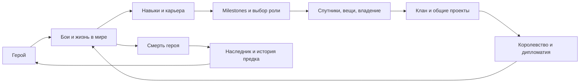

# BLT против ShedLink: аудит глубины механик

28.09.2026. **База ShedLink: `claude/poststream-2026-09-22`, `0cdf6338`.** Результат сохранён в рабочей папке 0.0.6; её runtime не использован вместо указанной ветки. Это исследование исходников и выбранной истории, без реализации, сборки сторонних модов, запуска игры и deployment.

## Краткая GAP-таблица

Категории: **A** — аналог уже есть; **B** — есть, но конкретное расширение BLT глубже; **C** — отдельная возможность отсутствует в рассмотренных активных путях; **D** — существующий вариант ShedLink предпочтительнее по указанному критерию; **E** — прямой перенос противоречит выбранной концепции или архитектуре. Категория относится к строке, а не ко всей системе. `HIST` — подтверждено историческим кодом; `GUIDE` — только описанием конфигурации; `HYP` — наша гипотеза, не найденная готовая BLT-механика.

Лицензии в таблице: **L** — BLT LGPL-2.1 reference, reuse условный; **M** — standalone MBGA заявляет MIT, но full notice/provenance требуют проверки; **F** — полный Mesmer fork со смешанным происхождением, не весь MIT; **I** — IDEA ONLY. Подробности и точные пины — в разделе источников. Ссылки P/C/W ведут к подробным разборам ниже с файлами, методами, API и сохранением.

| BLT mechanic | ShedLink equivalent | Gap | Adaptation value | Difficulty | Source/API | License |
|---|---|---|---|---|---|---|
| AdoptAHero, постоянный герой | Реальный Hero, identity/save, существование в кампании | A; не добавлять снова | Уже есть | — | [W](#world-details), HeroCreator/SyncData | L/F |
| Skills/focus/attributes | Native HeroDeveloper, покупка/прирост, snapshots | A | Уже есть | — | [P](#progression-details), HeroDeveloper | L/F |
| Class/build progression | Legacy классы + новый game-owned weapon build | B только для более богатых milestones | Высокая | Средняя–высокая | [P](#progression-details), ClassLevelRequirement | L/F |
| Achievement badges | 13 действующих Bannerlord achievements | A | Не создавать второй engine | — | [P](#progression-details), AchievementDef | L/F |
| Hero/class/weapon career stats | Агрегаты зрителя текущей кампании | B: scope героя, классовые/оружейные counters | Очень высокая | Средняя | [P](#progression-details), AchievementStatsData | L/F |
| Составные conditions и награды достижений | Фиксированные thresholds, notification | B: AND/сравнения, игровой unlock/награда | Высокая | Средняя | [P](#progression-details), IAchievementRequirement | L/F |
| Составные powers / per-effect unlock | Выбранная weapon power, skill ranks, specialization | B: несколько компонентов с разными условиями | Высокая | Высокая | [C](#combat-details), PowerGroupItemBase | L/F |
| Ally aura / реакция на low HP | Уже есть self-heal, poison, lifesteal, AoE и другие эффекты | B: кооперативная/реактивная роль | Средняя–высокая | Средняя–высокая | [C](#combat-details), Agent/mission ticks | M/F |
| Prestige reset | Iteration bonus + настоящая династия | C для reset-prestige; legacy уже частично есть | Условная | Высокая | [P](#progression-details), DoPrestige | F/I |
| Виртуальные gear T7/T8, бесконечные множители | Нативные items/modifiers и skill ranks | E для буквального переноса | Низкая | Баланс сложнее кода | [P](#progression-details), Agent patches | F/M |
| Обычная/элитная retinue | Recruit/upgrade/train/spawn/атрибуция/сейв | A | Уже есть | — | [C](#combat-details), UpgradeTargets | L/F |
| Второй отдельный roster | Один список basic/elite slots | B: группы/замена состава, не просто больше агентов | Средняя | Средняя | [C](#combat-details), Retinue2 | L/F |
| Guard + follow selected ally | Приказы отдельно герою | B: свита охраняет героя; герой сопровождает союзника | Высокая | Средняя, native риск | [C](#combat-details), Agent scripted AI | M |
| Hold/charge/siege orders | Hold/charge/skirmish/raid/walls/gate | A/D по набору наших приказов | Не переносить систему целиком | — | [C](#combat-details), HeroDetachmentBehavior | L/F |
| Summon escalation | Cooldown, side lock, once-per-battle retinue | B: рост задержки повторных призывов | Условная | Небольшая–средняя | [C](#combat-details), BLTSummonBehavior | L/F |
| Kill streaks / battle rewards | Вклад героя/свиты, milestones, anti-farm budget | A/D по учёту вклада | Не заменять плоской наградой | — | [C](#combat-details), BattlePayoutPolicy | L/F |
| Турнирная очередь и награды | Save-owned queue, rounds, приз, прогнозы, anti-snowball | A | Уже есть | — | [C](#combat-details), TournamentBehavior | L/F |
| Tournament loadout/round presets | Нативное снаряжение турнира с нашим roster | B: заранее известный формат/ограничения | Высокая | Средняя–высокая | [C](#combat-details), MatchEquipment/Rounds | L/F |
| Duel / PvP | Enemy summon и viewer tournaments | B только как targeted pursuit; это не consent 1v1 | Средняя | Средняя | [C](#combat-details), DuelMissionBehavior | M |
| Named companions, own gear/progression | Retinue, heirs, vassals — другие сущности | C/HIST: несколько личных Hero с собственной карьерой | Высокая | Высокая | [W](#world-details), BLTWandererBehavior | M/I |
| Scout/Surgeon/Engineer/Quartermaster roles | Нет viewer assignment в разобранном API | C/HYP: native API есть; полный BLT UX не доказан | Потенциально высокая | Средняя–высокая | [W](#world-details), MobileParty.SetParty… | I |
| Self-govern | Снятие Governor при других действиях | B: назначить самого viewer губернатором | Средняя | Средняя | [W](#world-details), ChangeGovernorAction | L/F |
| Marriage/children/family | Реальная семья, proposals/acceptance, children | A/D по Extension UX и durable proposals | Не добавлять заново | — | [W](#world-details), Hero.Spouse/MakePregnantAction | L/F |
| Назначение наследника | Автоматический подходящий ребёнок, stash/property succession | B: явный выбор до смерти | Высокая | Средняя | [W](#world-details), HeirCommand | L/F |
| Reborn / rejuvenation | Death→heir→dynasty | E по умолчанию: обесценивает смену поколений | Низкая без отдельного решения | Lifecycle риск высокий | [W](#world-details), HeroCreator/SetBirthDay | F/M/I |
| Custom modifier + name | OwnedId, точный ModifierId, сундук, reforge | B: личное имя/собственные свойства | Средняя–высокая | Средняя–высокая | [P](#progression-details), ItemModifier | L/F |
| Новый crafted WeaponDesign | Reforge уже существующего ItemObject | C: настоящий новый дизайн | Условно высокая | Высокая | [P](#progression-details), Crafting/private field | L/F |
| Случайный enchant | Гарантированное следующее native quality | D/E по предсказуемости действия | Не копировать ради случайности | — | [P](#progression-details), EnchantItem | F |
| Full item biography | OwnedId; BLT name/cost/current owner | C/HYP в обоих; BLT не доказан как готовый provenance engine | Средняя | Высокая | [P](#progression-details), event history | I |
| Gift / auction | Выключенный backend scaffold, active transfer нет | C: game-owned transfer, ownership check при закрытии | Социально высокая, сейчас зависимая | Высокая | [P](#progression-details), GiveItem/Auction | L/F |
| Native fief projects/budget | Владение/доходы, без building queue UI | B: управление реальной стройкой | Очень высокая | Средняя | [W](#world-details), BuildingHelper/Town | L/F |
| Clan prerequisite/bulk tree | Уже есть + native model bonuses | A | Не создавать заново | — | [W](#world-details), BLUpgradeModels | L/F |
| Fief/kingdom scopes, multi-prerequisites | Clan-scoped single-chain upgrades | B: территориальные и коллективные решения | Высокая | Высокая | [W](#world-details), UpgradeBehavior/models | L/F |
| Capital с последствиями утраты | Kingdom/fiefs уже существуют | C: специализация владения, перенос/cooldown | Средняя | Высокая | [W](#world-details), CapitalBehavior | L/F |
| Persistent training fund | Разовое обучение retinue + набор party troops | B: бюджет реального roster, max tier, daily work | Высокая | Средняя–высокая | [W](#world-details), PartyTroopUpgradeModel | L/F |
| Army roster controls | Create/disband/orders/cohesion | B: join/leave/call, управление конкретным составом | Средняя | Высокая | [W](#world-details), Army/MobileParty | L/F |
| Treaties/alliance/expiry | Война/мир/голосование/налоги/мятеж | B: соглашения, срок и совместные действия | Высокая, но большой scope | Очень высокая | [W](#world-details), treaty saves/events | L/F |
| Отдельный BLT Gold ledger | Native Hero.Gold + platform currency | E: не переносить теневую игровую экономику | Отрицательная для архитектуры | — | [P](#progression-details), HeroData.Gold | L/F |

## Главный вывод

Наиболее полезный результат BLT — **условия и связи между уже существующими действиями**: карьера героя открывает новые варианты, свитой можно командовать, владение можно развивать, имущество получает индивидуальность. Добавлять ещё один retinue, achievements или семейную систему не требуется.

ShedLink уже имеет сильную основу настоящей жизни в кампании, наследования, игрового инвентаря и Extension UI. Его заметные gaps — детализация карьеры, управление связанными сущностями и несколько конкретных игровых решений. Их следует добавлять через runtime catalogs/state/availability, а не новыми таблицами ванильных IDs в JS/Python.

**Не все кандидаты одинаково доказаны.** Статистика/предикаты, guard/follow, турниры и строительство подтверждены актуальными исходниками. Именованные спутники подтверждены также историческим кодом, но этот subsystem удалён из текущего standalone MBGA. Полная биография предмета и набор companion roles — собственные перспективные гипотезы, не найденные завершённые BLT-функции.

## Как проводилось исследование

Сначала прослежены текущие пути ShedLink, затем код четырёх внешних репозиториев, затем история выбранных механизмов и независимые проверки спорных выводов. Проверка CodeGraph завершилась `database is locked`; структурного покрытия графом нет. Использованы targeted reads и поиск с последующим чтением entrypoints, потребителей состояния и сохранения. README не использован как доказательство исполнения.

BLT автоматически регистрирует доступные handlers, но команды/rewards назначает конфигурация стримера. Следовательно, наличие handler в публичном коде не доказывает его включённость у GeneralEddy. HTML guide сохранён только во внешней research-папке, его hash записан; код развёрнутого TOR-модпака и exact configuration неизвестны. Правила рас/магии самого TOR не исследовались.

Три точных нюанса, изменивших выводы: achievements ShedLink есть, но keyed by viewer и сбрасываются при смене кампании; новый free build и старые классы сосуществуют; прежние smith/trophy/auction файлы отключены от viewer routes, тогда как reforge реально работает. Поэтому старый roadmap, имена файлов и прошлый аудит другой ветки не заменяют этот baseline.

### Общий transport уже есть

Viewer UI → `routes/bannerlord.py` (auth, currency/price, enqueue) → `routes/module_api.py:471` (poll) → `Net/ActionPoller.cs:103` → `ActionRegistry`/main-thread handler → native game effect → applied/failed ACK и отдельные события → module API/adapter → snapshot/API → frontend. Для конкретных механик ниже указаны отличия: game save, DB mirror, transient mission state, отключённые routes и неполные подтверждения. Наличие общей очереди не доказывает exactly-once эффект относительно отката игрового save.

## Top adaptations — вывод после исследования

Это ранжирование ценности, **не утверждённый roadmap реализации**. Оценка сложности относительная: небольшая — один понятный action/view над существующим состоянием; средняя — несколько слоёв и сохранение; высокая — новый lifecycle/native hooks/межсущностная согласованность. Сроки без отдельной спецификации не обещаются.

### 1. Карьера конкретного героя и milestones поверх имеющихся achievements

**Проблема:** текущие kills/tournament/level/gold агрегаты не различают жизни героев и специализации; после обычных caps мало персональных целей. **Зрителю:** понятные подвиги, профиль оружия/роли, ближайшее условие открытия; историю родителя можно хранить отдельно от достижений наследника.

Опора: existing achievements panel, `KillRewardBehavior`, `HeroIdentityBehavior`, tournament callbacks, save ledger. Источник идеи: BLT `AchievementStatsData`, `StatisticClassSpecificRequirement`, `AchievementDef.Apply`, `PowerGroupItemBase.Requirements` ([P](#progression-details)). Использовать native events и `CampaignBehaviorBase.SyncData`; обычные counters не требуют новых Harmony patches.

**Backend:** scopes hero/save/dynasty, зеркала и delivery identity. **Frontend:** критерии/прогресс в существующей карточке. **Migration:** вероятна новая per-hero projection; старые viewer totals нельзя автоматически распределить по умершим героям. **Save risk:** средний, additive versioned counters с определённым поведением при rollback. **Сложность:** средняя без игровых бонусов, выше с passive grants. **Зависимости:** устойчивая hero identity и snapshots; сначала решить, где истина — save и что сохраняется вне save. Не начинать с бесконечного damage bonus.

### 2. Управление существующим владением через native construction

**Проблема:** зритель владеет землёй, но почти не принимает решений о её повседневном развитии. **Зрителю:** актуальный список зданий, прогресс, очередь, daily project и бюджет стройки.

Опора: fief ownership/снимки, action pipeline, общие progress/entity blocks. Источник: `ManageFief.Project/ChangeGold` ([W](#world-details)). API: `Town.Buildings`, `BuildingsInProgress`, `BuildingHelper.ChangeCurrentBuildingQueue/ChangeDefaultBuilding`, `Town.BoostBuildingProcess`.

**Backend:** action registration, cached projection, права viewer; условия строительства проверяет игра. **Frontend:** список проектов и progress. **Migration:** не нужна для нативного сохранения зданий, возможно нужна для mirror. **Save risk:** низкий–средний при native helpers и повторной проверке владельца. **Сложность:** средняя. **Зависимости:** catalog по ID и quote/availability. Ловушка: native `BoostBuildingProcessWithGold` списывает с **Hero.MainHero**; нельзя применять его вслепую к герою зрителя. Деньги и бюджет должны изменяться для правильного владельца с проверкой эффекта.

### 3. Свита охраняет героя; герой сопровождает выбранного союзника

**Проблема:** свита развивается, но текущие detach commands управляют только героем. **Зрителю:** выбор роли на поле — прикрытие стрелка, сопровождение друга, бой рядом со своей группой.

Опора: существующие detach/order actions, `RetinueRegistry`, summoned-agent ownership. Источник: MBGA `GuardMissionBehavior`, `FormationFollowHeroCommand`, `FollowCombat` ([C](#combat-details)). API: `MissionBehavior`, Agent movement/automatic target selection, Team, WorldPosition. Reflection в приватности BLT для ShedLink не нужна.

**Backend:** проверка отправителя и доставка target EntityRef. **Frontend:** target picker и состояние приказа. **Migration:** не нужна для transient mission mode; понадобится, если сохранять предпочтение. **Save risk:** низкий; native AI/navigation риск средний. **Сложность:** средняя. **Зависимости:** authoritative retinue ownership и корректная очистка при смерти/конце mission. `guard off` в образце не полностью возвращает scripted AI: это знание о необходимом cleanup, а не готовая реализация для копирования.

### 4. Явный выбор наследника

**Проблема:** династия уже работает, но стратегический выбор следующего героя ограничен автоматическим выбором подходящего ребёнка. **Зрителю:** заранее выбранный преемник, понятный fallback при его смерти/смене клана.

Опора: существующие heirs, family, activation, stash/property succession. Источник: BLT `HeirCommand` + `BLTHeirBehavior` ([W](#world-details)). API: реальные Hero family/clan relations, existing native succession actions и save StringId.

**Backend:** projection выбранного ID, delivery; не выбирать по старому mirror. **Frontend:** выбрать из game-provided eligible list с причинами недоступности. **Migration:** вероятно поле projection/сейва; не обязательно новая подсистема. **Save risk:** средний, нужна проверка invalid/missing heir. **Сложность:** средняя. **Зависимости:** lifecycle contract и детерминированный fallback. BLT activation содержит подозрительный null path; копировать нужно идею выбора, не этот lifecycle код. Нынешний picker ребёнка для выделения вассала не является picker наследника.

### 5. Турнир как отдельный понятный формат соревнования

**Проблема:** очередь и награды есть; мало вариативности правил самого события. **Зрителю:** заранее объявленная дисциплина/gear preset и разные раунды, меньше преимущества постоянного снаряжения.

Опора: game-owned tournament queue, viewer roster, rounds/rewards/anti-snowball UI. Источник: Mesmer `ClassLoadout/CulturalUnified`, RC22 round presets ([C](#combat-details)). API: `TournamentParticipant.MatchEquipment`, runtime ItemObject pool, TournamentRound; hooks tournament equip/tree чувствительны к версии.

**Backend:** rules/state snapshot. **Frontend:** короткое объяснение правил до вступления. **Migration:** optional для сохранения выбранного preset; постоянный inventory не менять. **Save risk:** низкий при временном match gear, compatibility риск средний–высокий. **Сложность:** средняя–высокая. **Зависимости:** game catalog и правила powers в турнире. Один tier/weapon family **не гарантирует равенство** skills, HP, perks и модовых характеристик. Полная нормализация — отдельное решение, не доказанная готовая BLT-функция.

### 6. Именованные companions с собственной жизнью

**Проблема:** между безымянной retinue и отдельным вассальным кланом нет слоя персональных спутников. **Зрителю:** несколько узнаваемых Hero, их экипировка, обучение, потери и отношения с династией.

Опора: related entities/heirs/vassal display, owned equipment, skills, identity и save. Источник: исторический MBGA `352bb4c` WandererRecord/BLTWandererBehavior, фактические hire/self-progression/equipment/kill/battle paths ([W](#world-details)). Это новые Hero из wanderer templates, а не доказанная покупка конкретного существующего тавернного NPC. Native party roles — отдельное развитие через public `SetPartyScout/Surgeon/Engineer/Quartermaster`; BLT full role UI не подтверждён.

**Backend:** ownership projection, routing, никаких виртуальных Hero-статов. **Frontend:** entity cards + skills/equipment; reusable UI. **Migration:** вероятна для mirror, обязательна версия game-owned records. **Save risk:** высокий (Hero lifecycle, death, references, inheritance). **Сложность:** высокая. **Зависимости:** EntityRef/capabilities, событийная идентичность, проверка native lifecycle на текущем модпаке. Исторический extension был удалён в том числе ради сокращения crash surface; это перспективная независимая разработка, не «включить готовый файл».

### 7. Персональные вещи поверх уже имеющегося OwnedId

**Проблема:** вещи принадлежат герою и наследуются, но мало индивидуальности за пределами quality. **Зрителю:** имя и ограниченная персонализация конкретной вещи, позднее — созданный собственный дизайн.

Опора: exact OwnedId/ItemId/ModifierId, сундук, paid reforge rights, inheritance. Источник: `BLTCustomItemsCampaignBehavior`, `NameItem`, `RewardHelpers.GenerateCraftedWeapon` ([P](#progression-details)). Разделить три объёма: имя/custom modifier; новый WeaponDesign; полная биография вещи. Последняя не найдена готовой у BLT.

**Backend:** projection/UGC policy и entitlement; **Frontend:** имя/свойства/подтверждение выбора; **Migration:** вероятна для metadata. **Save risk:** средний для additive metadata, высокий для зарегистрированных динамических предметов. **Сложность:** средняя–высокая для именования, высокая для forging. **Зависимости:** единая identity при modifier changes, передачах/наследовании и откате save. BLT crafting читает private `_craftedItemObject` reflection; его нельзя обещать как стабильный public API. Полный owner-chain/kills/tournament timeline — самостоятельная гипотеза после identity, а не первый шаг.

### 8. Бюджет обучения настоящего отряда

**Проблема:** нынешнее bulk training улучшает abstract retinue; долгосрочного бюджета native party roster не видно. **Зрителю:** вложить ограниченную сумму, выбрать потолок tier, видеть расход/остаток и отменить план.

Опора: party management, recruitment routes, Hero.Gold, troop progression. Источник: RC22 `TrainingBehavior` и `PartyManagement` ([W](#world-details)). API: DailyTickHero, `PartyTroopUpgradeModel`, actual UpgradeTargets/MemberRoster.

**Backend:** статус/доставка; daily computation только в игре. **Frontend:** fund/ceiling/status/cancel. **Migration:** вероятна для projection, нужна game save metadata. **Save risk:** средний; расход должен выдерживать rollback/частичное выполнение. **Сложность:** средняя–высокая. **Зависимости:** правильная цена и все native prerequisites, не только gold cost; не повторять BLT предположение, что прямое изменение roster автоматически эквивалентно штатному upgrade.

### Остальные направления после оценки зависимостей

**Fief/kingdom upgrade scopes** имеют смысл после native property controls и общего entity catalog; prerequisites/bulk уже есть. **Capital/treaties** дают коллективные цели, но требуют больших изменений дипломатического lifecycle и совместимости. **Prestige** стоит проектировать как вариант mastery/legacy поверх настоящей династии; принудительный gear reset и вечный рост множителей не являются очевидным улучшением. **Gifts/auctions** нуждаются в exact item transfer, recovery и отдельной модели экономики; выключенный backend scaffold не считать готовым фундаментом рынка. Для этих кандидатов подробные BE/FE/save/API последствия приведены в P/W, но они не опережают автоматически более узкие расширения.

## Small high-value mechanics

| Дополнение | Точный прирост относительно текущего ShedLink | Почему ограниченный объём / зависимость |
|---|---|---|
| Показать следующий milestone и все причины lock | К skill rank добавить понятные игровые условия | UI читает game-computed criteria; само новое predicate исполнение отдельно |
| Career counter по оружию и турнирным раундам | Не очередные общие kills | Использует имеющиеся mission events; сначала hero/save scope |
| Учитывать voluntary/forced участие раздельно | Принудительное участие не ломает сознательно выбранную серию | Небольшое правило только если вводится соответствующая цель |
| Выбор native daily project владения | Новое решение для уже существующей земли | Использует Town/BuildingHelper; без своего дерева стат-бонусов |
| Выбор преемника до смерти | Управление имеющимся наследованием | Нужны eligible list и invalid-selection fallback |
| Follow конкретного союзника | Кооперативный приказ поверх текущего detach | Target ID + mission validation/cleanup |
| Предпросмотр турнирного preset | Зритель понимает, чем сражается | После game-defined tournament mode, не ручной список gear |
| Несколько prerequisite IDs для existing upgrades | Несколько необходимых улучшений вместо одного предшественника | Учитывать existing bulk logic и точный quote |
| Имя конкретной вещи | Личная реликвия поверх OwnedId | UGC/модификатор/save semantics; не глобальное переименование ItemObject |
| Утилизация по реальному paid cost | Free prize не превращается в денежный принтер | Не «пара строк»: cost basis и transfer/inheritance правила обязательны |

Не включены как новые: kill streaks, equipped-discard warning, обычные clan prerequisites, upgrade all, heirs, basic/elite retinue, free tournament predictions. Они уже существуют. Guard formation `line/shield/loose` из guide — интересная гипотеза; в текущем публичном GuardCommand эти presets не подтверждены.

## Things ShedLink already does better — не предлагать заново

1. **Настоящий династический мир вместо одного reset-процента.** Дети/наследники, вассалы, нативные кланы/королевства, наследование сундука и имущества образуют связанную жизнь. BLT тоже имеет family/heir функции; преимущество здесь в конкретной существующей связке и интерфейсе, не в заявлении «семьи у BLT нет».
2. **Игровые деньги остаются игровыми.** Hero.Gold используется для реальных действий; BLT HeroData.Gold — параллельный ledger. Не заменять наш ownership подход, хотя в retinue/upgrades ещё остаются server-owned части для миграции.
3. **Прозрачная reforge и exact inventory.** Покупается определённое следующее качество, есть paid rights и instance identity; random enchant случайного слота не автоматически глубже или удобнее.
4. **Учёт вклада в бой.** Разделение personal/retinue, diminishing curves и per-target damage budget уже глубже плоской оплаты убийств. Важно сохранить owner-tuned правила, а не подменить их BLT defaults.
5. **Текущие tactical orders.** Hold/charge/skirmish/raid/walls/gate уже существуют. Брать guard/target/follow как расширения, не переписывать всё под BLT IDetachment.
6. **Extension UX и подтверждения.** Карточки, exact IDs, цены/отказы, очередь/result/refund, family proposals и предупреждение при discard удобнее длинных чат-команд и индексов. Это оценка UX по исходникам, не измеренный usability-тест. Надёжность каждой ветки ещё требует своих проверок.
7. **Турнирная инфраструктура.** Save-owned queue, rounds/consolation, native prize, anti-snowball и бесплатные прогнозы уже есть. Gap — правила события, не ещё один tournament engine или перенос betting.

## Long-term gameplay loop

Из исследованных систем складываются две связанные траектории. Первая — **жизнь конкретного героя**: бои/мировая деятельность → навыки и карьера → осмысленные unlocks → спутники/личные вещи/управление владением. Вторая — **продолжение дома**: вклад героя → имущество и отношения клана → общие проекты королевства → смерть → выбранный наследник, наследство и сохранённая история предка.

Это не обязательная линейная лестница: не каждый зритель должен становиться королём. Боец, наставник спутников, управляющий феодом и организатор клана могут иметь разные цели. Prestige имеет смысл лишь если добавляет выбор и связывает поколения, а не заставляет всех много раз покупать тот же tier. История предмета — дополнительная связь между поколениями, если её identity действительно устойчива.

## Архитектурная граница адаптации

Игра определяет существующие Entity IDs, descriptors, state, requirements, eligibility, native price и результат. ShedLink определяет viewer identity, права, собственную валюту/entitlement, delivery и presentation. Присланные из игры условия нужны для отображения; окончательная игровая проверка остаётся в моде. Не копировать BLT chat parser, private BLT gold, culture/item allowlists или reflection в его внутренние типы.

Для первой реализации кандидата нужны не десятки новых таблиц, а конкретный контракт: session/save/entity identity, revision, catalog, current state, available action и reason, game quote, expected state и result. Расширение типовых UI-компонентов возможно постепенно; специальная карта/сложное представление остаются допустимыми. Эта граница соответствует предыдущему аудиту 0.0.6, но наличие конкретных механик установлено заново на указанной здесь ветке.

## Ограничения и проверка результата

Это широкий source-level аудит выбранных механизмов, не формальное доказательство отсутствия любого поведения во всех конфигурациях/старых бинарниках. Наличие функций устанавливалось по entrypoint/consumer/save path; отрицательные выводы ограничены просмотренными UI/routes/registries/models. Все runtime-файлы исходного checkout проверяются по хешам, исходные чужие изменения сохраняются. Пинованные source links проверяются на существование и диапазон строк; это дополняет чтение, не заменяет смысловую проверку.

Три независимых challenge-pass вынесены в `research/cross-review-*.md`; поправки учтены в основной оценке: tournament preset не равен полной нормализации, duel не равен согласию на1v1, companion history не равна текущей поставке. Финальная машинная проверка — [verification.json](verification.json). BLT builds, save loading, Twitch review и live gameplay не проверялись. Новые функции, миграции, frontend и DLL не создавались.

Далее — подробная карта ShedLink и сравнительные разборы с точными ссылками. Они включены в этот документ, чтобы для проверки вывода не требовалось восстанавливать переписку.
